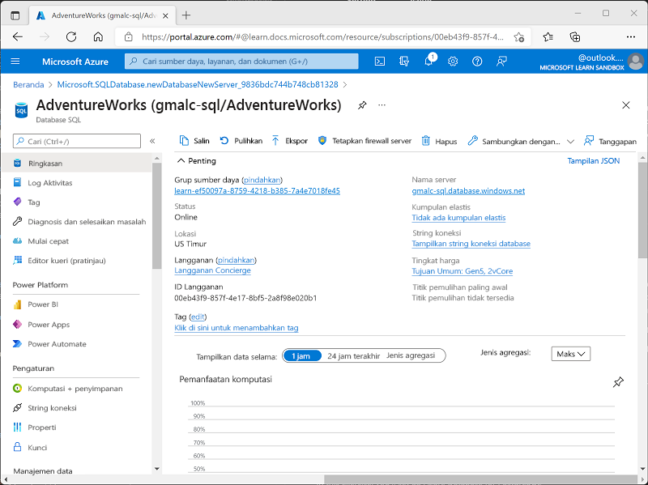
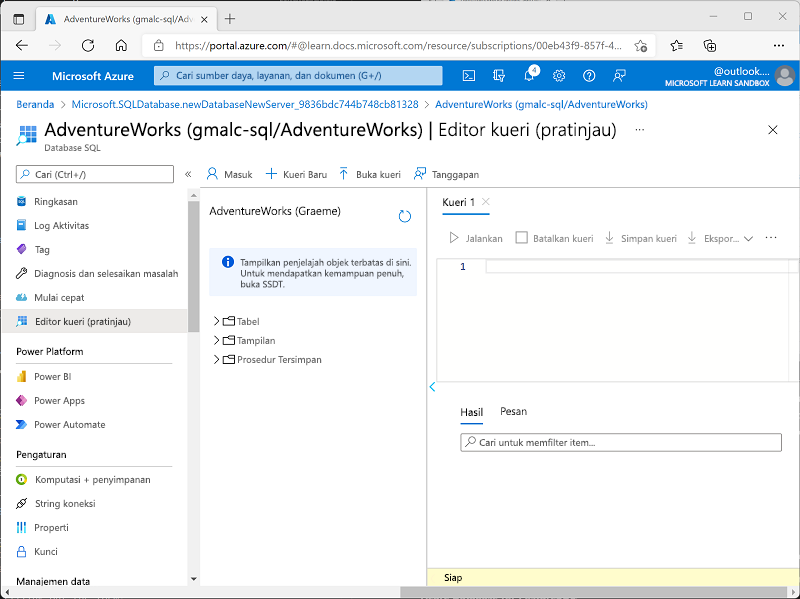

---
lab:
  title: Jelajahi Azure SQL Database
  module: Explore relational data in Azure
---

# <a name="explore-azure-sql-database"></a>Jelajahi Azure SQL Database

Dalam latihan ini, Anda akan memprovisikan sumber daya Azure SQL Database di langganan Azure, lalu menggunakan SQL untuk membuat kueri tabel dalam database hubungan.

Membutuhkan waktu sekitar **15** menit untuk menyelesaikan lab ini.

## <a name="before-you-start"></a>Sebelum Anda memulai

Anda memerlukan [langganan Azure](https://azure.microsoft.com/free) dengan akses tingkat administratif.

## <a name="provision-an-azure-sql-database-resource"></a>Memprovisikan sumber daya Azure SQL Database

1. In the <bpt id="p1">[</bpt>Azure portal<ept id="p1">](https://portal.azure.com?azure-portal=true)</ept>, select <bpt id="p2">**</bpt>&amp;#65291; Create a resource<ept id="p2">**</ept> from the upper left-hand corner and search for <bpt id="p3">*</bpt>Azure SQL<ept id="p3">*</ept>. Then in the resulting <bpt id="p1">**</bpt>Azure SQL<ept id="p1">**</ept> page, select <bpt id="p2">**</bpt>Create<ept id="p2">**</ept>.

1. Tinjau opsi Azure SQL yang tersedia, lalu di petak peta **Database SQL**, pastikan **Database tunggal** di pilih, lalu pilih **Buat**.

    

1. Masukkan nilai berikut di halaman **Buat SQL Database**:
    - **Langganan**: Pilih langganan Azure Anda.
    - **Grup sumber daya**: Buat grup sumber daya baru dengan nama pilihan Anda.
    - **Nama database**: *AdventureWorks*
    - <bpt id="p1">**</bpt>Server<ept id="p1">**</ept>:  Select <bpt id="p2">**</bpt>Create new<ept id="p2">**</ept> and create a new server with a unique name in any available location. Use <bpt id="p1">**</bpt>SQL authentication<ept id="p1">**</ept> and specify your name as the server admin login and a suitably complex password (remember the password - you'll need it later!)
    - **Ingin menggunakan kumpulan elastis SQL?**: *Tidak*
    - **Komputasi + penyimpanan**: Jangan ubah
    - **Redundansi penyimpanan cadangan**: *Penyimpanan cadangan redundan lokal*

1. On the <bpt id="p1">**</bpt>Create SQL Database<ept id="p1">**</ept> page, select <bpt id="p2">**</bpt>Next :Networking &gt;<ept id="p2">**</ept>, and on the <bpt id="p3">**</bpt>Networking<ept id="p3">**</ept> page, in the <bpt id="p4">**</bpt>Network connectivity<ept id="p4">**</ept> section, select <bpt id="p5">**</bpt>Public endpoint<ept id="p5">**</ept>. Then select <bpt id="p1">**</bpt>Yes<ept id="p1">**</ept> for both options in the <bpt id="p2">**</bpt>Firewall rules<ept id="p2">**</ept> section to allow access to your database server from Azure services and your current client IP address.

1. Pilih **Berikutnya: Keamanan >** dan atur opsi **Aktifkan Microsoft Defender untuk SQL** ke **Tidak sekarang**.

1. Pilih **Berikutnya: Pengaturan Tambahan >** dan pada tab **Pengaturan tambahan**, atur opsi **Gunakan data yang ada** ke **Sampel** (opsi ini akan membuat database sampel yang dapat Anda jelajahi nanti).

1. Pilih **Tinjau + Buat**, lalu pilih **Buat** untuk membuat database Azure SQL Anda.

1. Wait for deployment to complete. Then go to the resource that was deployed, which should look like this:

    

1. Pada panel di sisi kiri laman, pilih **Editor kueri (pratinjau)**, lalu masuk menggunakan info masuk dan sandi administrator yang Anda tentukan untuk server Anda.
    
    *Jika pesan kesalahan yang menyatakan bahwa alamat IP klien tidak diizinkan muncul, pilih tautan **Izinkan IP ...** di akhir pesan untuk mengizinkan akses dan mencoba masuk lagi (Anda sebelumnya menambahkan alamat IP klien komputer Anda sendiri ke aturan firewall, tetapi editor kueri dapat terhubung dari alamat yang berbeda tergantung pada konfigurasi jaringan Anda.)*
    
    Editor kueri terlihat seperti ini:
    
    

1. Perluas folder **Tables** untuk melihat tabel dalam database.

1. Di panel **Kueri 1**, masukkan kode SQL berikut:

    ```sql
    SELECT * FROM SalesLT.Product;
    ```

1. Pilih **&#9655; Jalankan** di atas kueri untuk menjalankannya dan melihat hasilnya, yang harus menyertakan semua kolom untuk semua baris dalam tabel **SalesLT.Product** seperti yang ditunjukkan di sini:

    

1. Ganti pernyataan SELECT dengan kode berikut, lalu pilih **&#9655; Jalankan** untuk menjalankan kueri baru dan tinjau hasilnya (yang hanya menyertakan kolom **ProductID**, **Name**, **ListPrice**, **ProductCategoryID**):

    ```sql
    SELECT ProductID, Name, ListPrice, ProductCategoryID
    FROM SalesLT.Product;
    ```

1. Sekarang coba kueri berikut, yang menggunakan JOIN untuk mendapatkan nama kategori dari tabel **SalesLT.ProductCategory**:

    ```sql
    SELECT p.ProductID, p.Name AS ProductName,
            c.Name AS Category, p.ListPrice
    FROM SalesLT.Product AS p
    JOIN [SalesLT].[ProductCategory] AS c
        ON p.ProductCategoryID = c.ProductCategoryID;
    ```

1. Tutup panel editor kueri, dengan membuang hasil editan Anda.

> **Tips**: Setelah selesai menjelajahi Azure SQL Database, Anda dapat menghapus grup sumber daya yang dibuat dalam latihan ini.
