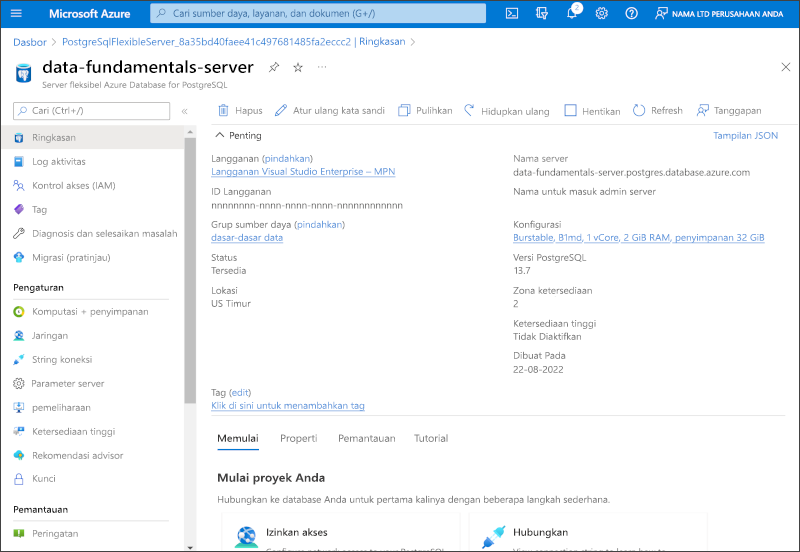

---
lab:
  title: Jelajahi Azure Database for PostgreSQL
  module: Explore relational data in Azure
---

# Jelajahi Azure Database for PostgreSQL

Dalam latihan ini, Anda akan menyediakan sumber daya Azure Database for PostgreSQL di langganan Azure Anda.

Membutuhkan waktu sekitar **5** menit untuk menyelesaikan lab ini.

## Sebelum memulai

Anda memerlukan [langganan Azure](https://azure.microsoft.com/free) dengan akses tingkat administratif.

## Memprovisikan sumber daya Azure Database for PostgreSQL

Dalam latihan ini, Anda akan memprovisikan sumber daya Azure Database for PostgreSQL.

1. Di portal Azure, pilih **&#65291; Buat sumber daya** dari sudut kiri atas dan cari `Azure Database for PostgreSQL`. Di halaman **Azure Database for PostgreSQL** yang dihasilkan, pilih **Buat**.

1. Tinjau opsi Azure Database for PostgreSQL yang tersedia, lalu di petak peta **Azure Database for PostgreSQL**, pilih **Server fleksibel (Disarankan)**, lalu **Buat**.

    

1. Masukkan nilai berikut di halaman **Buat SQL Database**:
    - **Langganan**: Pilih langganan Azure Anda.
    - **Grup sumber daya**: Buat grup sumber daya baru dengan nama pilihan Anda.
    - **Nama server**: Masukkan nama unik.
    - **Wilayah**: Pilih wilayah di dekat Anda.
    - **Versi PostgreSQL**: Biarkan tidak berubah.
    - **Jenis beban kerja**: Pilih **Pengembangan**.
    - **Komputasi + penyimpanan**: Biarkan tidak berubah.
    - **Zona ketersediaan**: Biarkan tidak berubah.
    - **Aktifkan ketersediaan tinggi**: Biarkan tidak berubah.
    - **Nama pengguna admin **: Nama Anda.
    - **Kata Sandi** dan **Konfirmasi kata sandi**: Kata sandi kompleks yang sesuai.

1. Pilih **Next: Networking**.

1. Di bagian **Aturan firewall**, pilih **&#65291; Tambahkan alamat IP klien saat ini**.

1. Pilih **Tinjau + buat**, lalu pilih **Buat** untuk membuat database Azure PostgreSQL Anda.

1. Tunggu hingga penerapan selesai. Lalu, buka sumber daya yang sudah disebarkan, yang akan terlihat seperti ini:

    

1. Tinjau opsi untuk mengelola sumber daya Azure Database for PostgreSQL Anda.

> **Tips**: Setelah selesai menjelajahi Azure Database for PostgreSQL, Anda dapat menghapus grup sumber daya yang dibuat dalam latihan ini.
