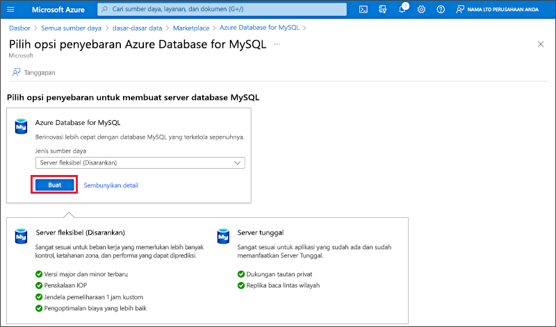
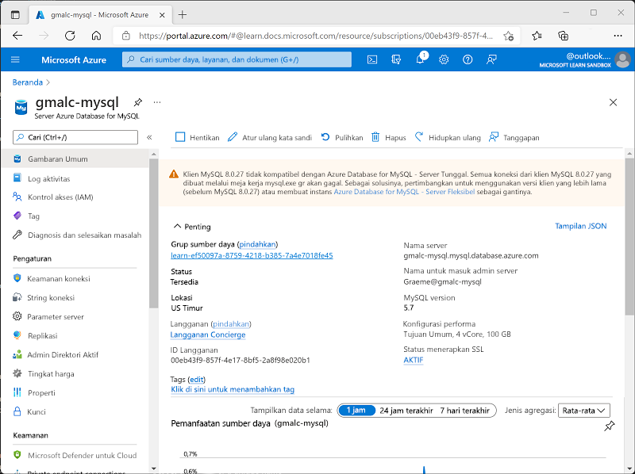

---
lab:
  title: Jelajahi Azure Database for MySQL
  module: Explore relational data in Azure
---

# Jelajahi Azure Database for MySQL

Dalam latihan ini Anda akan menyediakan sumber daya Azure Database for MySQL di langganan Azure Anda.

Membutuhkan waktu sekitar **5** menit untuk menyelesaikan lab ini.

## Sebelum memulai

Anda memerlukan [langganan Azure](https://azure.microsoft.com/free) dengan akses tingkat administratif.

## Memprovisikan sumber daya Azure Database for MySQL

Dalam latihan ini, Anda akan memprovisikan sumber daya Azure Database for MySQL.

1. Di portal Microsoft Azure, pilih **&#65291; Buat sumber daya** dari sudut kiri atas dan cari *Azure Database for MySQL*. Di halaman **Azure Database for MySQL** yang dihasilkan, pilih **Buat**.

1. Tinjau opsi Azure Database for MySQL yang tersedia. Kemudian, untuk **Jenis sumber daya**, pilih **Server Fleksibel** dan pilih **Buat**.

    

1. Masukkan nilai berikut di halaman **Buat SQL Database**:
    - **Langganan**: Pilih langganan Azure Anda.
    - **Grup sumber daya**: Buat grup sumber daya baru dengan nama pilihan Anda.
    - **Nama server**: Masukkan nama unik.
    - **Wilayah**: Setiap lokasi yang tersedia di dekat Anda.
    - **Versi MySQL**: Biarkan tidak berubah.
    - **Jenis beban kerja**: Untuk proyek pengembangan atau hobi.
    - **Komputasi + penyimpanan**: Biarkan tidak berubah.
    - **Zona ketersediaan**: Biarkan tidak berubah.
    - **Aktifkan ketersediaan tinggi**: Biarkan tidak berubah.
    - **Nama pengguna admin**: Nama Anda
    - **Kata sandi** dan **Konfirmasi kata sandi**: Kata sandi yang cukup rumit

1. Pilih **Next: Networking**.

1. Di bagian **Aturan firewall**, pilih **&#65291; Tambahkan alamat IP klien saat ini**.

1. Pilih **Tinjau + Buat**, lalu pilih **Buat** untuk membuat database Azure MySQL Anda.

1. Tunggu hingga penerapan selesai. Lalu, buka sumber daya yang sudah disebarkan, yang akan terlihat seperti ini:

    

1. Tinjau opsi untuk mengelola sumber daya Azure Database for MySQL Anda.

> **Tips**: Setelah selesai menjelajahi Azure Database for MySQL, Anda dapat menghapus grup sumber daya yang dibuat dalam latihan ini.
