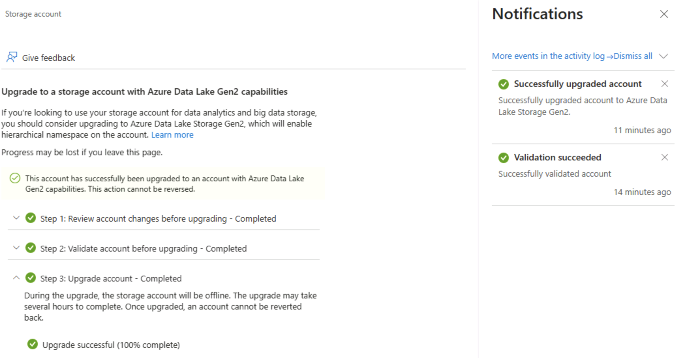
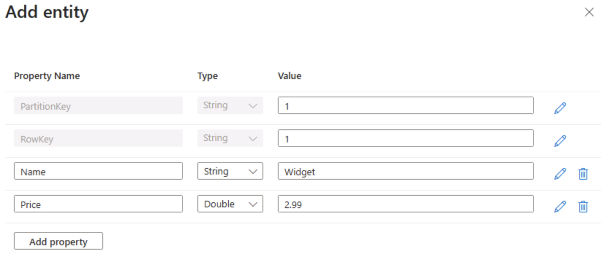

---
lab:
  title: Menjelajahi Azure Storage
  module: Explore Azure Storage for non-relational data
---

# Menjelajahi Azure Storage

Dalam latihan ini, Anda akan mempelajari cara memprovisikan dan mengonfigurasi akun Azure Storage, dan menjelajahi layanan intinya: Penyimpanan blob, Data Lake Storage Gen2, Azure Files, dan Azure Tables. Anda akan mendapatkan pengalaman langsung dalam membuat kontainer, mengunggah data, mengaktifkan namespace hierarkis, menyiapkan berbagi file, dan mengelola entitas tabel. Keterampilan ini akan membantu Anda memahami cara menyimpan, mengatur, dan mengamankan data non-relasional di Azure untuk berbagai skenario analitik dan aplikasi.

Membutuhkan waktu sekitar **15** menit untuk menyelesaikan lab ini.

> _**Tips**: Memahami tujuan setiap tindakan membantu Anda nanti merancang solusi penyimpanan yang menyeimbangkan biaya, performa, keamanan, dan tujuan analitik. Catatan Mengapa singkat ini mengikat setiap langkah dengan alasan dunia nyata._

## Sebelum memulai

Anda memerlukan [langganan Azure](https://azure.microsoft.com/free) dengan akses tingkat administratif.

## Memprovisikan akun Azure Storage

Langkah pertama dalam menggunakan Azure Storage adalah memprovisikan akun Azure Storage di langganan Azure Anda.

> _**Tips**: Akun penyimpanan adalah batas yang aman dan dapat ditagih untuk semua layanan Azure Storage (blob, file, antrean, tabel). Kebijakan, redundansi, enkripsi, jaringan, dan kontrol akses berlaku dari sini ke bawah._

1. Jika Anda belum memprovisikannya, masuk ke [portal Microsoft Azure](https://portal.azure.com?azure-portal=true).

1. Pada beranda portal Azure, pilih **&#65291; Buat sumber daya** dari sudut kiri atas dan cari `Storage account`. Kemudian di halaman **Akun penyimpanan** yang dihasilkan, pilih **Buat**.

    

1. Masukkan nilai berikut pada halaman **Buat akun penyimpanan**:
   
    - **Langganan**: Pilih langganan Azure Anda.
    - **Grup sumber daya**: Buat grup sumber daya baru dengan nama pilihan Anda.
    - **Nama akun penyimpanan**: Masukkan nama unik untuk akun penyimpanan Anda menggunakan huruf kecil dan angka.
    - **Wilayah**: Pilih lokasi yang tersedia.
    - **Kinerja**: *Standar*
    - **Redundansi**: *Penyimpanan yang redundan secara lokal (LRS)*

    

    > _**Tips**: Grup sumber daya baru memudahkan pembersihan. Standar + LRS adalah garis besar berbiaya terendah, baik untuk belajar. LRS menyimpan tiga salinan sinkron di satu wilayah, memadai untuk data demo non-kritis tanpa membayar replikasi geografis._

1. Pilih **Berikutnya: Tingkat Lanjut >** dan lihat opsi konfigurasi tingkat lanjut. Secara khusus, perhatikan bahwa ini adalah tempat Anda dapat mengaktifkan namespace layanan hierarkis untuk mendukung Azure Data Lake Storage Gen2. Biarkan opsi **<u>ini dikosongkan**</u> (Anda akan mengaktifkannya nanti), lalu pilih **Berikutnya: Jaringan >** untuk melihat opsi jaringan untuk akun penyimpanan Anda.
   
   

1. Pilih **Berikutnya: Perlindungan data >**, lalu di bagian **Pemulihan**, <u>batalkan</u> pilihan semua opsi **Aktifkan penghapusan sementara...**. Opsi ini mempertahankan file yang dihapus untuk pemulihan berikutnya, tetapi dapat menyebabkan masalah nanti saat Anda mengaktifkan namespace layanan hierarkis.

    

1. Lanjutkan melalui halaman **Berikutnya >** yang ada tanpa mengubah pengaturan default apa pun, lalu pada halaman **Tinjau**, tunggu hingga pilihan Anda divalidasi dan pilih **Buat** untuk membuat akun Azure Storage.

1. Tunggu hingga penerapan selesai. Lalu buka sumber daya yang disebarkan.

## Menjelajahi penyimpanan blob

Sekarang setelah memiliki akun Azure Storage, Anda dapat membuat kontainer untuk data blob.

> _**Tips**: Kontainer mengelompokkan blob dan merupakan tingkat cakupan pertama untuk kontrol akses. Dimulai dengan penyimpanan blob biasa (tanpa namespace hierarkis) menunjukkan perilaku folder virtual yang akan Anda bandingkan dengan Data Lake Gen2 nanti._

1. Unduh file JSON [product1.json](https://aka.ms/product1.json?azure-portal=true) dari `https://aka.ms/product1.json` dan simpan di komputer (Anda dapat menyimpannya di folder mana pun - Anda akan mengunggahnya ke penyimpanan blob nanti).

    *Jika file JSON ditampilkan di browser Anda, klik kanan halaman, dan pilih **Simpan Sebagai**. Beri nama file  **product1.json** dan simpan di folder unduhan Anda.* 

2. Di halaman portal Azure untuk kontainer penyimpanan Anda, di sisi kiri, pada bagian **Penyimpanan data**, pilih **Kontainer**.
   
    

3. Di halaman **Kontainer** , pilih **&#65291; Tambahkan kontainer** dan tambahkan kontainer baru bernama `data` dengan tingkat **akses anonim Privat (tanpa akses anonim)**.

    

    > _**Tips**: Privat menjaga data sampel Anda tetap aman. Akses publik jarang diperlukan kecuali untuk situs web statis atau skenario data terbuka. Penamaannya `data` membuat contoh ini sederhana dan dapat dibaca._

4. Setelah kontainer **data** dibuat, verifikasi bahwa kontainer tersebut tercantum di halaman **Kontainer**.

5. Di panel sebelah kiri, di bagian atas, pilih **Browser penyimpana**. Halaman ini menyediakan antarmuka berbasis browser yang dapat Anda gunakan untuk bekerja dengan data di akun penyimpanan.

6. Di halaman browser penyimpanan, pilih **Kontainer blob** dan verifikasi bahwa kontainer **data** Anda dicantumkan.

7. Pilih kontainer **data**, dan perhatikan bahwa kontainer tersebut kosong.

    

8. Pilih **&#65291; Tambahkan Direktori** dan baca informasi tentang folder sebelum membuat direktori baru bernama `products`.

9. Di browser penyimpanan, verifikasi bahwa tampilan saat ini menunjukkan konten folder **produk** yang baru saja dibuat - perhatikan bahwa "breadcrumbs" di bagian atas halaman menampilkan jalur **Kontainer blob > data > produk**.

    

10. Di breadcrumb, pilih **data** untuk beralih ke kontainer **data**, dan perhatikan bahwa kontainer tersebut <u>tidak</u> berisi folder bernama **produk**.

    Folder dalam penyimpanan blob adalah virtual, dan hanya ada sebagai bagian dari jalur blob. Karena folder **produk** tidak berisi blob, itu tidak benar-benar ada!

    > _**Tips**: Namespace datar berarti direktori hanyalah awalan nama (produk/file.json). Desain ini memungkinkan skala besar karena layanan mengindeks nama blob alih-alih mempertahankan struktur pohon yang sebenarnya._

11. Gunakan tombol **&#10514; Unggah** untuk membuka panel **Unggah blob**.

12. Di panel **Unggah blob**, pilih file **product1.json** yang sebelumnya Anda simpan di komputer lokal. Kemudian di bagian **Tingkat Lanjut** , dalam kotak **Unggah ke folder** , masukkan `product_data` dan pilih tombol **Unggah** .

    

    > _**Tips**: Menyediakan nama folder saat mengunggah secara otomatis membuat jalur virtual, yang menggambarkan bahwa kehadiran blob membuat "folder" muncul._

13. Tutup panel **Unggah blob** jika masih terbuka, dan verifikasi bahwa folder virtual **product_data** telah dibuat di kontainer **data**.

14. Pilih folder **product_data** dan verifikasi bahwa folder tersebut berisi blob **product1.json** yang Anda unggah.

15. Di sisi kiri, di bagian **Penyimpanan data**, pilih **Kontainer**.

16. Buka kontainer **data**, dan verifikasi bahwa folder **product_data** yang Anda buat dicantumkan.

17. **Pilih &#x2027; &#x2027; &#x2027;** ikon di ujung kanan folder, dan perhatikan bahwa menu tidak menampilkan opsi apa pun. Folder dalam kontainer blob namespace datar bersifat virtual, serta tidak dapat dikelola.

    

    > _**Tips**: Tidak ada objek direktori nyata, sehingga tidak ada operasi penggantian nama/izin — yang memerlukan namespace hierarkis._

18. Gunakan ikon **X** di kanan atas halaman **data** untuk menutup halaman dan kembali ke halaman **Kontainer**.

## Menjelajahi Azure Data Lake Storage Gen2

Dukungan Azure Data Lake Store Gen2 memungkinkan Anda menggunakan folder hierarkis untuk mengatur dan mengelola akses ke blob. Ini juga memungkinkan Anda menggunakan penyimpanan blob Azure untuk menghosting sistem file terdistribusi untuk platform analitik big data yang umum.

> _**Tips**: Mengaktifkan namespace hierarkis membuat folder bersifat seperti direktori nyata. Ini juga memungkinkan Anda melakukan tindakan folder dengan aman (sekaligus, tanpa kesalahan) dan memberi Anda kontrol izin file yang mirip dengan yang ada di Linux. Ini sangat membantu ketika bekerja dengan alat big data seperti Spark atau Hadoop, atau saat mengelola data lake yang besar dan terorganisir._

1. [Unduh file JSON product2.json](https://aka.ms/product2.json?azure-portal=true) dari `https://aka.ms/product2.json` dan simpan di komputer Anda di folder yang sama tempat Anda mengunduh **product1.json** sebelumnya - Anda akan mengunggahnya ke penyimpanan blob nanti.

1. Di halaman portal Microsoft Azure untuk akun penyimpanan Anda, di sisi kiri, gulir ke bawah ke bagian **Pengaturan**, dan pilih **Peningkatan Azure Data Lake Gen2**.

    

1. **Di halaman peningkatan** Data Lake Gen2, perluas dan selesaikan setiap langkah untuk meningkatkan akun penyimpanan Anda untuk mengaktifkan namespace hierarkis dan mendukung Azure Data Lake Storage Gen. Ini mungkin memakan waktu.

    

    > _**Tips**: Peningkatan adalah sakelar kemampuan tingkat akun — data tetap ada, tetapi semantik direktori berubah untuk mendukung operasi tingkat lanjut._

1. Setelah peningkatan selesai, pada panel sisi kiri, di bagian atas, pilih **Browser penyimpanan** dan navigasikan kembali ke akar kontainer blob **data** Anda, yang masih berisi folder **product_data**.

1. Pilih folder **product_data**, dan pastikan folder tersebut masih berisi file **product1.json** yang Anda unggah sebelumnya.

1. Gunakan tombol **&#10514; Unggah** untuk membuka panel **Unggah blob**.

1. Di panel **Unggah blob**, pilih file **product2.json** yang Anda simpan di komputer lokal. Kemudian pilih tombol **Unggah**.

1. Tutup panel **Unggah blob** jika masih terbuka, dan verifikasi bahwa folder **product_data** sekarang berisi file **product2.json**.

    

    > _**Tips**: Menambahkan file kedua pasca-peningkatan mengonfirmasi kelangsungan yang mulus: blob yang ada masih berfungsi, dan yang baru mendapatkan manfaat hierarkis seperti ACL direktori (Daftar Kontrol Akses)._

1. Di sisi kiri, di bagian **Penyimpanan data**, pilih **Kontainer**.

1. Buka kontainer **data**, dan verifikasi bahwa folder **product_data** yang Anda buat dicantumkan.

1. Pilih ikon **&#x2027;&#x2027;&#x2027;** di ujung kanan folder, dan perhatikan bahwa saat namespace hierarkis diaktifkan, Anda dapat mengerjakan tugas konfigurasi di tingkat folder; termasuk mengganti nama folder dan mengatur izin.

    

    > _**Tips**: Folder nyata memungkinkan Anda menerapkan keamanan hak istimewa paling sedikit pada granularitas folder, mengganti nama dengan aman, dan mempercepat daftar rekursif versus memindai ribuan nama blob awalan._

1. Gunakan ikon **X** di kanan atas halaman **data** untuk menutup halaman dan kembali ke halaman **Kontainer**.

## Menjelajahi Azure Files

Azure Files menyediakan cara untuk membuat berbagi berbasis cloud.

> _**Tips**: Azure Files menawarkan titik akhir SMB/NFS untuk skenario lift-and-shift di mana aplikasi mengharapkan sistem file tradisional. Ini melengkapi (tidak menggantikan) penyimpanan blob dengan mendukung kunci file dan alat ASLI OS._

1. Di halaman portal Azure untuk kontainer penyimpanan Anda, di sisi kiri, di bagian **Penyimpanan data**, pilih **Berbagi**.

    

1. Di halaman Berbagi file, pilih **&#65291; Berbagi** file dan tambahkan berbagi file baru bernama `files` menggunakan tingkat Transaksi yang dioptimalkan****.

1. Pilih **Berikutnya: Pencadangan >** dan nonaktifkan pencadangan. Pilih **Tinjau + buat**.

    

    > _**Tips**: Menonaktifkan pencadangan akan mengurangi biaya untuk lingkungan lab berumur pendek — Anda akan mengaktifkannya untuk ketahanan produksi._

1. Di **Berbagi**, buka **berbagi** baru Anda.

1. Di bagian atas halaman, pilih **Hubungkan**. Kemudian di panel **Hubungkan**, perhatikan bahwa ada tab untuk sistem operasi umum (Windows, Linux, dan macOS) yang berisi skrip yang dapat Anda jalankan untuk menghubungkan ke folder bersama dari komputer klien.

    

    > _**Tips**: Skrip yang dihasilkan menunjukkan dengan tepat cara memasang berbagi menggunakan perintah platform-native, mengilustrasikan pola akses hibrid dari komputer virtual, kontainer, atau server lokal._

1. Tutup panel **Hubungkan** lalu tutup halaman **file** guna kembali ke halaman **Berbagi** untuk akun penyimpanan Azure Anda.

## Menjelajahi Azure Table

Azure Table menyediakan penyimpanan kunci/nilai untuk aplikasi yang perlu menyimpan nilai data, tetapi tidak memerlukan fungsionalitas dan struktur penuh dari database hubungan.

> _**Tips**: Penyimpanan tabel memperdagangkan kueri &gabungan yang kaya untuk biaya sangat rendah, fleksibilitas tanpa skema, dan skala horizontal — ideal untuk log, data IoT, atau profil pengguna._

1. Di halaman portal Azure untuk kontainer penyimpanan Anda, di sisi kiri, di bagian **Penyimpanan data**, pilih **Tabel**.

    

1. Pada halaman **Tabel** , pilih **&#65291; Tabel** dan buat tabel baru bernama `products`.

1. Setelah tabel **produk** dibuat, pada panel di sebelah kiri, di bagian atas, pilih **Browser penyimpanan**.

1. Di penjelajah penyimpanan, pilih **Tabel** dan verifikasi bahwa tabel **produk** dicantumkan.

1. Pilih tabel **produk**.

1. Di halaman **produk**, pilih **&#65291; Tambahkan entitas**.

1. Di panel **Tambahkan entitas**, masukkan nilai kunci berikut:
    - **PartitionKey**: 1
    - **RowKey**: 1

    > _**Tips**: PartitionKey mengelompokkan entitas terkait untuk mendistribusikan beban; RowKey secara unik mengidentifikasi dalam partisi. Bersama-sama mereka membentuk kunci primer komposit cepat untuk pencarian._

1. Pilih **Tambahkan properti**, dan buat dua propertues baru dengan nilai berikut:

    |Nama properti | Tipe | Nilai |
    | ------------ | ---- | ----- |
    | Nama | String | Widget |
    | Harga | Laju | 2,99 |

    

1. Pilih **Sisipkan** untuk menyisipkan baris entitas baru ke dalam tabel.

1. Di browser penyimpanan, verifikasi bahwa baris telah ditambahkan ke tabel **produk**, dan kolom **Stempel waktu** telah dibuat untuk menunjukkan kapan baris terakhir diubah.

1. Tambahkan entitas lain ke tabel **produk** dengan properti berikut:

    |Nama properti | Tipe | Nilai |
    | ------------ | ---- | ----- |
    | PartitionKey | String | 1 |
    | RowKey | String | 2 |
    | Nama | String | Kniknak |
    | Harga | Laju | 1,99 |
    | Dihentikan | Boolean | TRUE |

    > _**Tips**: Menambahkan entitas kedua dengan kunci yang berbeda dan properti Boolean tambahan menunjukkan fleksibilitas skema-on-write — atribut baru tidak memerlukan migrasi._

1. Setelah menyisipkan entitas baru, verifikasi bahwa baris yang berisi produk yang dihentikan ditampilkan dalam tabel.

    Anda telah memasukkan data secara manual ke dalam tabel menggunakan antarmuka browser penyimpanan. Dalam skenario nyata, pengembang aplikasi dapat menggunakan Azure Storage Table API untuk membangun aplikasi yang membaca dan menulis nilai ke tabel, menjadikannya solusi yang hemat biaya dan scalable untuk penyimpanan NoSQL.

> _**Tips**: Jika Anda telah selesai menjelajahi Azure Storage, Anda dapat menghapus grup sumber daya yang Anda buat dalam latihan ini. Menghapus grup sumber daya adalah cara tercepat untuk menghindari biaya yang sedang berlangsung dengan menghapus setiap sumber daya yang Anda buat dalam satu tindakan._
