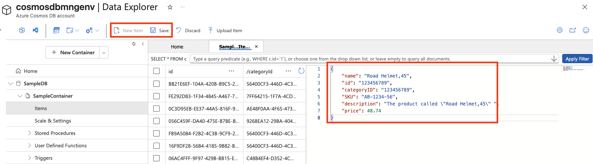

---
lab:
  title: Menjelajahi Azure Cosmos DB
  module: Explore fundamentals of Azure Cosmos DB
---
# Menjelajahi Azure Cosmos DB

Dengan menyelesaikan lab ini, Anda akan mempelajari cara memprovisikan akun Azure Cosmos DB, membuat database sampel dan kontainer, menambahkan dan melihat item JSON, dan menjalankan kueri seperti SQL untuk mengambil data. Anda akan mendapatkan pengalaman langsung dengan portal Azure dan memahami bagaimana Cosmos DB mendukung penyimpanan dan kueri data non-relasional yang fleksibel.

Membutuhkan waktu sekitar **15** menit untuk menyelesaikan lab ini.

## Sebelum memulai

Anda memerlukan [langganan Azure](https://azure.microsoft.com/free) dengan akses tingkat administratif.

## Membuat akun Cosmos DB

Untuk menggunakan Cosmos DB, Anda harus menyediakan akun Cosmos DB di langganan Azure Anda. Dalam latihan ini, Anda akan menyediakan akun Cosmos DB yang menggunakan Azure Cosmos DB untuk NoSQL.

1. Di portal Azure, pilih **+ Buat sumber daya** di kiri atas, dan cari `Azure Cosmos DB`.  Di hasil, pilih **Azure Cosmos DB** dan pilih **Buat**.

    

1. Di petak **Azure Cosmos DB untuk NoSQL**, pilih **Buat**.

    
   
    > _**Tips**: Akun adalah tingkat teratas untuk sumber daya Cosmos DB Anda. Memilih Azure Cosmos DB for NoSQL memungkinkan Anda menyimpan dan mengkueri data JSON dengan bahasa kueri sederhana seperti SQL._

1. Masukkan detail berikut, lalu pilih **Tinjau + Buat**:
   
    - **Jenis** Beban Kerja: Pembelajaran
    - **Langganan**: Jika Anda menggunakan kotak pasir, pilih *Langganan Concierge*. Atau, pilih langganan Azure.
    - **Grup sumber daya**: Jika Anda menggunakan kotak pasir, pilih grup sumber daya yang ada (yang akan diberi nama seperti *learn-xxxx...*). Jika tidak, buat grup sumber daya baru dengan nama pilihan Anda.
    - **Nama Akun**: Masukkan nama unik
    - **Zona** Ketersediaan: Nonaktifkan
    - **Lokasi**: Pilih lokasi yang disarankan
    - **Mode kapasitas**: Throughput yang disediakan
    - **Terapkan Diskon Tingkat Gratis**: Pilih Terapkan jika tersedia
    - **Batasi total throughput akun**: Tidak dipilih
  
    > _**Mengapa pilihan ini?**_
    >
    > _Kami mengatur **jenis** beban kerja ke Pembelajaran karena dilengkapi dengan default ramah pemula yang membuat pengaturan lebih mudah dan menjaga biaya tetap rendah. Nama** akun Anda **harus unik di seluruh layanan, karena menjadi bagian dari URL layanan Anda. Kami memilih lokasi** yang **dekat dengan Anda sehingga pengujian Anda berjalan lebih cepat; lokasi mana yang Anda lihat akan bergantung pada langganan Anda dan apakah zona ketersediaan tertentu diaktifkan. Untuk **mode** kapasitas, kami akan menggunakan throughput yang Disediakan sehingga performa tetap dapat diprediksi selama lab singkat ini—meskipun Tanpa Server dapat baik-baik saja jika Anda hanya membutuhkannya sesekali. **Jika tingkat** gratis tersedia, kami akan menggunakannya sehingga Anda dapat bereksperimen tanpa dikenakan biaya. Akhirnya, kami menjaga pengaturan "**batas total throughput** akun" dinonaktifkan sehingga tidak ada yang diperlambat secara tak terduga saat Anda bekerja._

1. Ketika konfigurasi telah divalidasi, pilih **Buat**.

    > _**Tips**: Portal Microsoft Azure akan memperkirakan berapa lama waktu yang dibutuhkan untuk menyediakan instans CosmosDB ini. Perkiraan waktu pembuatan dihitung berdasarkan lokasi yang Telah Anda pilih._

1. Tunggu hingga penerapan selesai. Lalu pergi ke sumber daya yang disebarkan.

## Membuat database sampel

*Sepanjang prosedur ini, tutup semua tips yang ditampilkan di portal*.

1. Pada halaman akun Cosmos DB baru Anda, di panel sebelah kiri, pilih **Data Explorer**.

    

1. Di halaman **Data Explorer**, pilih **Luncurkan mulai cepat**.

    > _**Tips**: Mulai cepat membuat database kerja, kontainer, dan data sampel sehingga Anda dapat berlatih menambahkan dan mengkueri item tanpa merancang skema terlebih dahulu._

1. Di tab **Kontainer baru**, tinjau pengaturan yang telah diisi sebelumnya untuk database sampel, lalu pilih **OK**.

1. Amati status di panel di bagian bawah layar hingga database **SampleDB** dan kontainer **SampleContainer** telah dibuat (yang mungkin memerlukan waktu sekitar satu menit).

## Melihat dan membuat item

1. Di halaman Data Explorer, luaskan database **SampleDB** dan kontainer **SampleContainer**, lalu pilih **Item** untuk melihat daftar item dalam kontainer. Item mewakili data produk, masing-masing dengan id unik dan properti lainnya.

    

1. Pilih salah satu item dalam daftar untuk melihat representasi JSON dari data item.

1. Di bagian atas halaman, pilih **Item Baru** untuk membuat item kosong baru.

1. Ubah JSON untuk item baru sebagai berikut, lalu pilih **Simpan**.

    ```json
   {
       "name": "Road Helmet,45",
       "id": "123456789",
       "categoryID": "123456789",
       "SKU": "AB-1234-56",
       "description": "The product called \"Road Helmet,45\" ",
       "price": 48.74
   }
    ```

    

1. Setelah menyimpan item baru, perhatikan bahwa properti metadata tambahan ditambahkan secara otomatis.

    > _**Tips**: Cosmos DB menyimpan item sebagai JSON (JavaScript Object Notation), sehingga Anda dapat menambahkan bidang yang sesuai dengan skenario Anda tanpa skema kaku. `id` harus unik dalam kontainer. Setelah Anda menyimpan, Cosmos DB menambahkan properti sistem (seperti tanda waktu dan pengidentifikasi internal) untuk membantu mengelola dan mengoptimalkan data Anda:_
    > - *_rid — ID sumber daya internal yang digunakan oleh Cosmos DB untuk mengidentifikasi item secara internal.*
    > - *_self — Tautan sumber daya lengkap untuk item.*
    > - *_etag — Tag entitas yang digunakan untuk pemeriksaan konkurensi optimis.*
    > - *_ts — Tanda waktu Unix (dalam detik) saat item terakhir diubah.*
    > - *_attachments — Tautan ke lampiran dokumen (jika ada).*

## Mengkueri database

1. Di halaman **Data Explorer**, pilih ikon **Kueri SQL Baru**.

    

1. Di editor Kueri SQL, tinjau kueri default (`SELECT * FROM c`) dan gunakan tombol **Jalankan Kueri** untuk menjalankannya.

1. Tinjau hasilnya, yang mencakup representasi JSON lengkap dari semua item.

1. Ubah kueri sebagai berikut:

    ```sql
   SELECT *
   FROM c
   WHERE CONTAINS(c.name,"Helmet")
    ```

    > _**Tips**: NoSQL API menggunakan kueri seperti SQL yang sudah dikenal untuk mencari dokumen JSON. `SELECT * FROM c` mencantumkan semua item, dan `CONTAINS` memfilter menurut teks di dalam properti—berguna untuk pencarian cepat tanpa penyiapan tambahan._

1. Gunakan tombol **Jalankan Kueri** untuk menjalankan kueri yang direvisi dan tinjau hasilnya, yang mencakup entitas JSON untuk item apa pun dengan bidang **nama** yang berisi teks "Helm.".

    

1. Tutup editor Kueri SQL, buang perubahan Anda.

    Anda telah melihat cara membuat dan mengkueri entitas JSON dalam database Cosmos DB menggunakan antarmuka penjelajah data di portal Microsoft Azure. Di kehidupan nyata, pengembang aplikasi akan menggunakan salah satu dari banyak kit pengembangan perangkat lunak (SDK) khusus bahasa pemrograman untuk memanggil NoSQL API dan bekerja dengan data dalam database.

> _**Tips**: Jika Anda telah selesai menjelajahi Azure Cosmos DB, Anda dapat menghapus grup sumber daya yang Anda buat dalam latihan ini._
