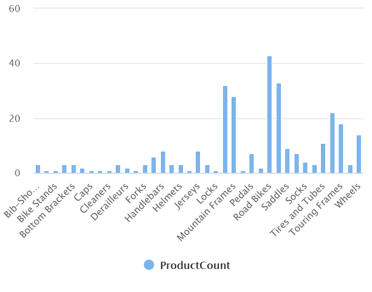

---
lab:
  title: Menjelajahi analitik data di Azure dengan Azure Synapse Analytics
  module: Explore fundamentals of large-scale data warehousing
---

# Menjelajahi analitik data di Azure dengan Azure Synapse Analytics

Dalam latihan ini, Anda akan memprovisikan ruang kerja Azure Synapse Analytics di langganan Azure Anda, dan menggunakannya untuk menyerap dan membuat kueri data.

Membutuhkan waktu sekitar **30** menit untuk menyelesaikan lab ini.

## Sebelum memulai

Anda memerlukan [langganan Azure](https://azure.microsoft.com/free) dengan akses tingkat administratif.

## Menentukan ruang kerja Azure Synapse Analytics

Untuk menggunakan Azure Synapse Analytics, Anda harus menyediakan sumber daya Ruang Kerja Azure Synapse Analytics di langganan Azure Anda.

1. Buka portal Microsoft Azure di [https://portal.azure.com](https://portal.azure.com?azure-portal=true), dan masuk menggunakan info masuk yang terkait dengan langganan Azure Anda.

    > **Tips**: Pastikan untuk menggunakan direktori yang berisi langganan Anda - terletak di kanan atas di bawah ID pengguna. Jika tidak, pilih ikon pengguna dan ubah direktori.

2. Di portal Microsoft Azure, di halaman **Beranda**, gunakan **&#65291; Buat ikon sumber daya** untuk membuat sumber daya baru.
3. Cari *Azure Synapse Analytics*, dan buat sumber daya **Azure Synapse Analytics** yang baru dengan pengaturan berikut:
    - **Langganan**: *Langganan Azure Anda*
        - **Grup sumber daya**: *Buat grup sumber daya baru dengan nama yang sesuai, seperti "synapse-rg"*
        - **Kelompok sumber daya terkelola**: *Masukkan nama yang sesuai, misalnya "synapse-managed-rg"*.
    - **Nama ruang kerja**: *Masukkan nama ruang kerja yang unik, misalnya "synapse-ws-<your_name>"*.
    - **Wilayah**: *Pilih salah satu wilayah berikut*:
        - Australia Timur
        - AS Tengah
        - AS Timur 2
        - Eropa Utara
        - US Tengah Selatan
        - Asia Tenggara
        - UK Selatan
        - Eropa Barat
        - US Barat
        - WestUS 2
    - **Pilih Data Lake Storage Gen 2**: Dari langganan
        - **Nama akun**: *Buat akun baru dengan nama unik, misalnya "datalake<your_name>"*.
        - **Nama sistem file**: *Buat sistem file baru dengan nama yang unik, misalnya "fs<your_name>"*.

    > **Catatan**: Ruang kerja Synapse Analytics memerlukan dua grup sumber daya dalam langganan Azure; satu untuk sumber daya yang dibuat secara eksplisit, dan satu lagi untuk sumber daya terkelola yang digunakan oleh layanan. Hal ini juga memerlukan akun penyimpanan Data Lake untuk menyimpan data, skrip, dan artefak lainnya.

4. Saat Anda memasukkan detail ini, pilih **Tinjau + buat**, lalu pilih **Buat** untuk membuat ruang kerja.
5. Tunggu hingga ruang kerja selesai dibuat - mungkin memerlukan waktu lima menit atau lebih.
6. Saat penyebaran selesai, buka grup sumber daya yang dibuat dan perhatikan bahwa grup tersebut berisi ruang kerja Synapse Analytics Anda dan akun penyimpanan Data Lake.
7. Pilih ruang kerja Synapse Anda, dan di halaman **Gambaran umum**, di kartu **Buka Synapse Studio**, pilih **Buka** untuk membuka Synapse Studio di tab browser baru. Synapse Studio adalah antarmuka berbasis web yang dapat digunakan untuk bekerja dengan ruang kerja Synapse Analytics Anda.
8. Di sisi kiri Synapse Studio, gunakan ikon **&rsaquo;&rsaquo;** untuk memperluas menu - menu ini mengungkapkan halaman yang berbeda dalam Synapse Studio yang akan Anda gunakan untuk mengelola sumber daya dan melakukan tugas analisis data, seperti yang ditampilkan di sini:

    

## Menyerap data

Salah satu tugas utama yang dapat Anda lakukan dengan Azure Synapse Analytics adalah menentukan *alur* yang mentransfer (dan jika perlu, mentransformasi) data dari berbagai sumber ke ruang kerja Anda untuk dianalisis.

1. Di Synapse Studio, pada halaman **Beranda**, pilih **Serap** untuk membuka **alat Salin Data**.
2. Di alat Salin Data, pada langkah **Properti**, pastikan **Tugas salin bawaan** dan **Jalankan sekali sekarang** dipilih, dan klik **Berikutnya >**.
3. Pada langkah **Sumber**, dalam substep **Himpunan data**, pilih pengaturan berikut:
    - **Jenis sumber**: Semua
    - **Koneksi**: *Buat koneksi baru, dan di panel **Koneksi baru** yang muncul, pada tab **Protokol generik**, pilih **HTTP**. Kemudian lanjutkan dan buat koneksi ke file data menggunakan pengaturan berikut:*
        - **Nama**: Produk AdventureWorks
        - **Deskripsi**: Daftar produk melalui HTTP
        - **Sambungkan melalui runtime integrasi**: AutoResolveIntegrationRuntime
        - **URL dasar**: `https://raw.githubusercontent.com/MicrosoftLearning/DP-900T00A-Azure-Data-Fundamentals/master/Azure-Synapse/products.csv`
        - **Validasi Sertifikat Server**: Aktifkan
        - **Jenis autentikasi**: Anonim
4. Setelah membuat koneksi, pada substep **Sumber/Himpunan data**, pastikan pengaturan berikut dipilih, lalu pilih **Berikutnya >**:
    - **URL relatif**: *Biarkan kosong*
    - **Metode Permintaan**: GET
    - **Header tambahan**: *Biarkan kosong*
    - **Salinan biner**: <u>Tidak</u> dipilih
    - **Waktu tunggu permintaan habis**: *Biarkan kosong*
    - **Koneksi serentak maksimal**: *Biarkan kosong*
5. Pada langkah **Sumber**, dalam sub langkah **Konfigurasi**, pilih **Pratinjau data** untuk melihat pratinjau data produk yang akan diserap oleh alur Anda, lalu tutup pratinjau.
6. Setelah melakukan pratinjau data, pada langkah **Sumber/Konfigurasi**, pastikan pengaturan berikut dipilih, lalu pilih **Berikutnya >**:
    - **Format file**: DelimitedText
    - **Pemisah kolom**: Koma (,)
    - **Pemisah baris**: Umpan baris (\n)
    - **Baris pertama sebagai header**: Dipilih
    - **Jenis pemadatan**: Tidak ada
7. Pada langkah **Target**, dalam sub langkah **Himpunan data**, harap pilih pengaturan berikut:
    - **Jenis target**: Azure Data Lake Storage Gen 2
    - **Koneksi**: *Pilih koneksi yang ada ke penyimpanan data lake Anda (ini dibuat untuk Anda saat Anda membuat ruang kerja).*
8. Setelah memilih koneksi, pada langkah **Target/Himpunan data**, pastikan pengaturan berikut dipilih, kemudian pilih **Berikutnya >**:
    - **Jalur folder**: *Telusuri ke folder sistem file Anda*
    - **Nama file**: products.csv
    - **Perilaku salin**: Tidak ada
    - **Koneksi serentak maksimal**: *Biarkan kosong*
    - **Ukuran blok (MB)**: *Biarkan kosong*
9. Pada langkah **Target**, dalam sub langkah **Konfigurasi**, pastikan properti berikut telah dipilih. Kemudian, pilih **Berikutnya >**:
    - **Format file**: DelimitedText
    - **Pemisah kolom**: Koma (,)
    - **Pemisah baris**: Umpan baris (\n)
    - **Tambahkan header ke file**: Dipilih
    - **Jenis pemadatan**: Tidak ada
    - **Baris maks per file**: *Biarkan kosong*
    - **Awalan nama file**: *Biarkan kosong*
10. Pada langkah **Pengaturan**, masukkan pengaturan berikut lalu klik **Berikutnya >**:
    - **Nama tugas**: Salin produk
    - **Deskripsi tugas** Salin data produk
    - **Toleransi kegagalan**: *Biarkan kosong*
    - **Aktifkan pengelogan**: <u>Tidak</u> dipilih
    - **Aktifkan pentahapan**: <u>Tidak</u> dipilih
11. Pada langkah **Tinjau dan selesaikan** pada sub langkah **Tinjau**, baca ringkasan lalu klik **Berikutnya >**.
12. Pada langkah **Penyebaran**, harap tunggu alur disebarkan lalu klik **Selesai**.
13. Di Synapse Studio, pilih halaman **Pemantauan**, dan di tab **Eksekusi alur**, tunggu hingga alur **Salin produk** selesai dengan status **Berhasil** (Anda dapat menggunakan tombol **&#8635; Refresh** pada halaman Eksekusi alur untuk merefresh status).
14. Pada halaman **Data**, pilih tab **Ditautkan** dan perluas hierarki **Azure Data Lake Storage Gen 2** hingga Anda melihat penyimpanan file untuk ruang kerja Synapse. Kemudian, pilih penyimpanan file untuk memverifikasi bahwa file bernama **products.csv** telah disalin ke lokasi ini, seperti yang ditunjukkan di sini:

    

## Menggunakan kumpulan SQL untuk menganalisis data

Setelah menyerap data ke ruang kerja, Anda dapat menggunakan Synapse Analytics untuk mengkueri dan menganalisisnya. Salah satu cara paling umum untuk mengkueri data adalah dengan menggunakan SQL, dan di Synapse Analytics Anda dapat menggunakan *kumpulan SQL* untuk menjalankan kode SQL.

1. Di Synapse Studio, klik kanan file **products.csv** di penyimpanan file untuk ruang kerja Synapse Anda, arahkan ke **Skrip SQL baru**, dan pilih **Pilih baris 100 TERATAS**.
2. Di panel **Skrip SQL 1** yang terbuka, tinjau kode SQL yang sudah dibuat, yang seharusnya mirip dengan ini:

    ```SQL
    -- This is auto-generated code
    SELECT
        TOP 100 *
    FROM
        OPENROWSET(
            BULK 'https://datalakexx.dfs.core.windows.net/fsxx/products.csv',
            FORMAT = 'CSV',
            PARSER_VERSION='2.0'
        ) AS [result]
    ```

    Kode ini membuka set baris dari file teks yang Anda impor dan mengambil 100 baris data pertama.

3. Dalam daftar **sambungkan ke**, pastikan **Bawaan** dipilih - hal ini mewakili Kumpulan SQL bawaan yang dibuat dengan ruang kerja Anda.
4. Pada toolbar, gunakan tombol **&#9655; Jalankan** untuk menjalankan kode SQL, dan tinjau hasilnya, yang seharusnya terlihat mirip dengan ini:

    | C1 | c2 | c3 | c4 |
    | -- | -- | -- | -- |
    | ProductID | ProductName | Golongan | ListPrice |
    | 771 | Mountain-100 Perak, 38 | Sepeda Gunung | 3399,9900 |
    | 772 | Mountain-100 Perak, 42 | Sepeda Gunung | 3399,9900 |
    | ... | ... | ... | ... |

5. Perhatikan hasilnya terdiri dari empat kolom bernama C1, C2, C3, dan C4; dan baris pertama dalam hasil berisi nama bidang data. Untuk memperbaiki masalah ini, tambahkan parameter HEADER_ROW = TRUE ke fungsi OPENROWSET seperti yang ditunjukkan di sini (mengganti *datalakexx* dan *fsxx* dengan nama akun penyimpanan data lake dan sistem file Anda), lalu jalankan kembali kueri:

    ```SQL
    SELECT
        TOP 100 *
    FROM
        OPENROWSET(
            BULK 'https://datalakexx.dfs.core.windows.net/fsxx/products.csv',
            FORMAT = 'CSV',
            PARSER_VERSION='2.0',
            HEADER_ROW = TRUE
        ) AS [result]
    ```

    Sekarang hasilnya akan terlihat seperti ini:

    | ProductID | ProductName | Golongan | ListPrice |
    | -- | -- | -- | -- |
    | 771 | Mountain-100 Perak, 38 | Sepeda Gunung | 3399,9900 |
    | 772 | Mountain-100 Perak, 42 | Sepeda Gunung | 3399,9900 |
    | ... | ... | ... | ... |

6. Memodifikasi kueri sebagai berikut (mengganti *datalakexx* dan *fsxx* dengan nama akun penyimpanan dan sistem file data lake Anda):

    ```SQL
    SELECT
        Category, COUNT(*) AS ProductCount
    FROM
        OPENROWSET(
            BULK 'https://datalakexx.dfs.core.windows.net/fsxx/products.csv',
            FORMAT = 'CSV',
            PARSER_VERSION='2.0',
            HEADER_ROW = TRUE
        ) AS [result]
    GROUP BY Category;
    ```

7. Jalankan kueri yang sudah diubah, yang akan menampilkan hasil yang berisi produk angka di setiap kategori, seperti ini:

    | Golongan | ProductCount |
    | -- | -- |
    | Bib Shorts | 3
           |
    | Rak Sepeda | 1 |
    | ... | ... |

8. Di panel **Properti** untuk **Skrip SQL 1**, ubah **Nama** menjadi **Hitung Produk berdasarkan Kategori**. Lalu di toolbar, pilih **Terbitkan** untuk menyimpan skrip.

9. Tutup panel skrip **Hitung Produk berdasarkan Kategori**.

10. Di Synapse Studio, pilih halaman **Kembangkan**, dan perhatikan bahwa skrip SQL **Hitung Produk berdasarkan Kategori** yang diterbitkan telah disimpan di sana.

11. Pilih skrip SQL **Hitung Produk berdasarkan Kategori** untuk membukanya kembali. Kemudian, pastikan skrip terhubung ke kumpulan SQL **Bawaan** dan jalankan untuk mengambil jumlah produk.

12. Di panel **Hasil**, pilih tampilan **Bagan**, lalu pilih pengaturan berikut untuk bagan tersebut:
    - **Jenis bagan**: Kolom
    - **Kolom kategori**: Kategori
    - **Kolom legenda (seri)**: ProductCount
    - **Posisi legenda**: bawah - tengah
    - **Label legenda (seri)**: *Biarkan kosong*
    - **Nilai minimum label legenda (seri)**: *Biarkan kosong*
    - **Label legenda (seri) maksimum**: *Biarkan kosong*
    - **Label kategori**: *Biarkan kosong*

    Bagan yang dihasilkan akan menyerupai ini:

    

## Gunakan kumpulan Spark untuk menganalisis data

Sementara SQL adalah bahasa umum untuk mengkueri himpunan data terstruktur, banyak analis data menemukan bahasa seperti Python yang berguna untuk mengeksplorasi dan mempersiapkan data untuk analisis. Di Azure Synapse Analytics, Anda dapat menjalankan kode Python (dan lainnya) di *Kumpulan Spark*; yang menggunakan mesin pemrosesan data terdistribusi berdasarkan Apache Spark.

1. Di Synapse Studio, pilih halaman **Kelola**.
2. Pilih tab **Kumpulan Apache Spark**, lalu gunakan ikon **&#65291; Baru** untuk membuat kumpulan Spark baru dengan pengaturan berikut:
    - **Nama kumpulan Apache Spark**: spark
    - **Kelompok ukuran node**: Memori Dioptimalkan
    - **Ukuran node**: Kecil (4 vCore/32 GB)
    - **Skala otomatis**: Diaktifkan
    - **Jumlah node** 3----3
3. Tinjau dan buat kumpulan Spark, lalu tunggu kumpulan Spark disebarkan (yang mungkin memerlukan waktu beberapa menit).
4. Ketika kumpulan Spark telah disebarkan, di Synapse Studio, pada halaman **Data**, telusuri ke sistem file untuk ruang kerja Synapse Anda. Kemudian klik kanan **products.csv**, arahkan ke **Buku catatan baru**, dan pilih **Muat ke DataFrame**.
5. Di panel **Buku catatan 1** yang terbuka, dalam daftar **Lampirkan ke**, pilih kumpulan Spark **spark** yang akan dibuat sebelumnya dan pastikan **Bahasa** diatur ke **PySpark (Python)**.
6. Tinjau kode di sel pertama (dan satu-satunya) di buku catatan, yang akan terlihat seperti ini:

    ```Python
    %%pyspark
    df = spark.read.load('abfss://fsxx@datalakexx.dfs.core.windows.net/products.csv', format='csv'
    ## If header exists uncomment line below
    ##, header=True
    )
    display(df.limit(10))
    ```

7.  Pilih **&#9655; Jalankan** di sebelah kiri sel kode untuk menjalankannya, dan tunggu hasilnya. Pertama kali Anda menjalankan sel di buku catatan, kumpulan Spark dimulai - jadi mungkin perlu waktu satu menit atau lebih untuk menampilkan hasil.

    > **Catatan**: Jika terjadi kesalahan karena Kernel Python belum tersedia, jalankan kembali sel.

8. Akhirnya, hasilnya akan muncul di bawah sel, dan hasilnya akan mirip dengan ini:

    | _c0_ | _c1_ | _c2_ | _c3_ |
    | -- | -- | -- | -- |
    | ProductID | ProductName | Golongan | ListPrice |
    | 771 | Mountain-100 Perak, 38 | Sepeda Gunung | 3399,9900 |
    | 772 | Mountain-100 Perak, 42 | Sepeda Gunung | 3399,9900 |
    | ... | ... | ... | ... |

9. Hapus komentar pada baris *,header = True* (karena file products.csv memiliki header kolom di baris pertama), sehingga kode Anda terlihat seperti ini:

    ```Python
    %%pyspark
    df = spark.read.load('abfss://fsxx@datalakexx.dfs.core.windows.net/products.csv', format='csv'
    ## If header exists uncomment line below
    , header=True
    )
    display(df.limit(10))
    ```

10. Jalankan kembali sel tersebut dan pastikan hasilnya terlihat seperti ini:

    | ProductID | ProductName | Golongan | ListPrice |
    | -- | -- | -- | -- |
    | 771 | Mountain-100 Perak, 38 | Sepeda Gunung | 3399,9900 |
    | 772 | Mountain-100 Perak, 42 | Sepeda Gunung | 3399,9900 |
    | ... | ... | ... | ... |

    Perhatikan bahwa menjalankan sel lagi membutuhkan waktu lebih ingkat, karena kumpulan Spark sudah dimulai.

11. Di bagian hasil, gunakan ikon **Kode &#65291;** untuk menambahkan sel kode baru ke buku catatan.
12. Di sel kode kosong yang baru, tambahkan kode berikut:

    ```Python
    df_counts = df.groupBy(df.Category).count()
    display(df_counts)
    ```

13. Pilih **&#9655; Jalankan** ke kiri untuk menjalankan sel kode baru, dan tinjau hasilnya, yang akan terlihat seperti ini:

    | Golongan | jumlah |
    | -- | -- |
    | Headset | 3
           |
    | Roda | 14 |
    | ... | ... |

14. Dalam output hasil untuk sel, pilih tampilan **Bagan**. Bagan yang dihasilkan akan menyerupai ini:

    

15. Tutup panel **Buku catatan 1** dan buang perubahan Anda.

## Menghapus sumber daya Azure

Setelah selesai menjelajahi Azure Synapse Analytics, Anda harus menghapus sumber daya yang telah Anda buat untuk menghindari biaya Azure yang tidak perlu.

1. Tutup tab browser Synapse Studio dan kembali ke portal Microsoft Azure.
2. Di portal Microsoft Azure, pada halaman **Beranda**, pilih **Grup sumber daya**.
3. Pilih grup sumber daya untuk ruang kerja Synapse Analytics Anda (bukan grup sumber daya terkelola), dan pastikan grup berisi ruang kerja Synapse, akun penyimpanan, dan kumpulan Spark untuk ruang kerja Anda.
4. Di bagian atas halaman **Gambaran Umum** untuk grup sumber daya, pilih **Hapus grup sumber daya**.
5. Masukkan nama grup sumber daya untuk mengonfirmasi bahwa Anda ingin menghapusnya, dan pilih **Hapus**.

    Setelah beberapa menit, ruang kerja Azure Synapse Anda dan ruang kerja terkelola yang terkait dengannya akan dihapus.
