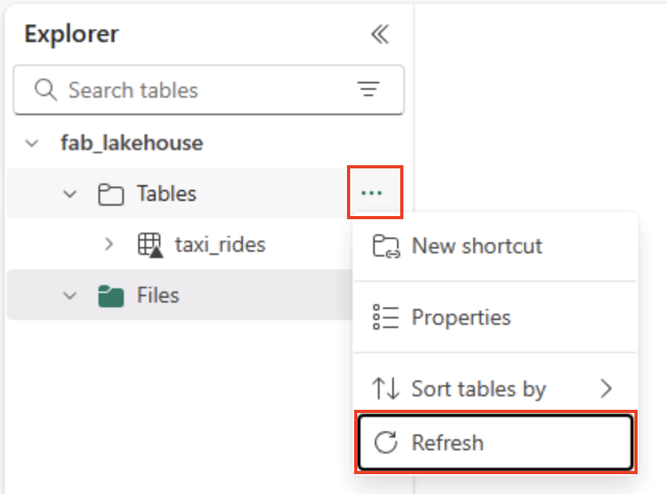

---
lab:
  title: Menjelajahi analitik data di Microsoft Fabric
  module: Explore fundamentals of large-scale data analytics
---

# Menjelajahi analitik data di Microsoft Fabric

Dalam latihan ini Anda akan menjelajahi penyerapan dan analitik data di Microsoft Fabric Lakehouse.

Dengan menyelesaikan lab ini, Anda akan:

- **Memahami konsep** Microsoft Fabric Lakehouse: Pelajari cara membuat ruang kerja dan lakehouse, yang merupakan pusat untuk mengatur dan mengelola aset data di Fabric.
- **Menyerap data menggunakan alur**: Gunakan alur yang dipandu untuk membawa data eksternal ke lakehouse, membuatnya siap kueri tanpa pengkodan manual.
- **Menjelajahi dan mengkueri data dengan SQL**: Menganalisis data yang diserap menggunakan kueri SQL yang sudah dikenal, mendapatkan wawasan langsung dalam Fabric.
- **Mengelola sumber daya**: Pelajari praktik terbaik untuk membersihkan sumber daya untuk menghindari biaya yang tidak perlu.

## Latar belakang pada Himpunan Data Taksi NYC:

Himpunan data "Taksi - Hijau" NYC berisi catatan terperinci tentang perjalanan taksi di Kota New York, termasuk waktu penjemputan dan pengantaran, lokasi, jarak perjalanan, tarif, dan jumlah penumpang. Ini banyak digunakan dalam analitik data dan pembelajaran mesin untuk menjelajahi mobilitas perkotaan, prakiraan permintaan, dan deteksi anomali. Di lab ini, Anda akan menggunakan himpunan data dunia nyata ini untuk mempraktikkan penyerapan dan analisis data di Microsoft Fabric.

Membutuhkan waktu sekitar **25** menit untuk menyelesaikan lab ini.

> **Catatan**: Anda memerlukan lisensi Microsoft Fabric untuk menyelesaikan latihan ini. Lihat [Mulai menggunakan Fabric](https://learn.microsoft.com/fabric/get-started/fabric-trial) untuk detail cara mengaktifkan lisensi uji coba Fabric gratis. Anda akan memerlukan akun *sekolah*atau *kerja* Microsoft untuk melakukan ini. Jika Anda tidak memilikinya, Anda bisa [mendaftar untuk uji coba Microsoft Office 365 E3 atau yang lebih tinggi](https://www.microsoft.com/microsoft-365/business/compare-more-office-365-for-business-plans).

*Pertama kali Anda menggunakan fitur Microsoft Fabric apa pun, perintah dengan tips mungkin muncul. Tutup ini.*

## Membuat ruang kerja

Sebelum mengerjakan data di Fabric, buat ruang kerja dengan uji coba Fabric diaktifkan.

> _**Tips**: Ruang kerja adalah kontainer Anda untuk semua aset (lakehouse, alur, notebook, laporan). Mengaktifkan kapasitas Fabric memungkinkan item ini berjalan._

1. Navigasi ke [beranda](https://app.fabric.microsoft.com/home?experience=fabric) Microsoft Fabric di `https://app.fabric.microsoft.com/home?experience=fabric` browser, dan masuk dengan kredensial Fabric Anda.

1. Pada bilah menu di sebelah kiri, pilih **Ruang Kerja** (ikon terlihat mirip dengan ).

    

1. Buat ruang kerja baru dengan nama pilihan Anda, pilih mode lisensi di bagian **Tingkat Lanjut** yang mencakup kapasitas Fabric (*Uji Coba*, *Premium*, atau *Fabric*).

    > _**Tips** Memilih kapasitas yang mencakup Fabric memberi ruang kerja mesin yang diperlukan untuk tugas rekayasa data. Menggunakan ruang kerja khusus membuat sumber daya lab Anda terisolasi dan mudah dibersihkan._

1. Saat ruang kerja baru Anda terbuka, ruang kerja harus kosong.

    

## Membuat lakehouse

Sekarang setelah Anda memiliki ruang kerja, saatnya untuk membuat lakehouse untuk file data Anda.

> _**Tips**: Lakehouse menyaingkan file dan tabel di OneLake. Anda dapat menyimpan file mentah dan juga membuat tabel Delta terkelola yang bisa Anda kueri dengan SQL._

1. Pada bilah menu di sebelah kiri, pilih **Buat**. Di halaman *Baru*, di bawah bagian *Rekayasa Data*, pilih **Lakehouse**. Beri nama unik pilihan Anda.

    >**Catatan**: Jika **opsi Buat** tidak disematkan ke bar samping, Anda perlu memilih opsi elipsis (**...**) terlebih dahulu.

    

    Setelah satu menit atau lebih, lakehouse baru akan dibuat:

    

1. Lihat lakehouse baru, dan perhatikan bahwa panel **Penjelajah lakehouse** di sebelah kiri memungkinkan Anda menelusuri tabel dan file di lakehouse:
   
    - Folder **Tabel** berisi tabel yang bisa Anda kueri menggunakan semantik SQL. Tabel di lakehouse Microsoft Fabric didasarkan pada format file *Delta Lake* sumber terbuka, yang umum digunakan dalam Apache Spark.
    - Folder **File** berisi file data di penyimpanan OneLake untuk lakehouse yang tidak terkait dengan tabel delta terkelola. Anda juga dapat membuat *pintasan* di folder ini untuk mereferensikan data yang disimpan secara eksternal.

    Saat ini, tidak ada tabel atau file di lakehouse.

    > _**Tips**: Gunakan File untuk data mentah atau bertahap, dan Tabel untuk himpunan data siap kueri yang dikumpulkan. Tabel didukung oleh Delta Lake sehingga mendukung pembaruan yang andal dan kueri yang efisien._

## Menyerap data

Cara sederhana untuk menyerap data adalah dengan menggunakan aktivitas **Salin Data** dalam alur untuk mengekstrak data dari sumber dan menyalinnya ke file di lakehouse.

> _**Tips**: Alur menyediakan cara yang dipandu dan dapat diulang untuk membawa data ke lakehouse. Mereka lebih mudah daripada pengkodan dari awal dan dapat dijadwalkan nanti jika diperlukan._

1. Pada halaman **Beranda** untuk lakehouse Anda, di **menu Dapatkan data** , pilih **Alur** data baru, dan buat alur data baru bernama **Ingest Data**.

    

1. **Di wizard Salin Data**, pada **halaman Pilih sumber** data, pilih **Sampel data** lalu pilih **himpunan data sampel Taksi - Hijau** NYC.

    

    

1. Pada halaman **Sambungkan ke sumber** data, lihat tabel di sumber data. Harus ada satu meja yang berisi detail perjalanan taksi di New York City. Lalu pilih **Berikutnya** untuk melanjutkan ke **halaman Sambungkan ke tujuan** data.

1. **Pada halaman Sambungkan ke tujuan** data, atur opsi tujuan data berikut ini, lalu pilih **Berikutnya**:
    - **Folder akar**: Tabel
    - **Memuat pengaturan**: Muat ke tabel baru
    - **Nama** tabel tujuan: taxi_rides *(Anda mungkin perlu menunggu pratinjau pemetaan kolom ditampilkan sebelum Anda dapat mengubahnya)*
    - **Pemetaan kolom**: *Biarkan pemetaan default apa adanya*
    - **Aktifkan partisi**: *Tidak dipilih*

    

    > _**Mengapa pilihan ini?**_
    > 
    > _Kita mulai dengan Tabel sebagai **akar** sehingga data langsung masuk ke tabel Delta terkelola, yang dapat Anda kueri segera. Kami memuatnya ke dalam **tabel** baru sehingga lab ini tetap mandiri dan tidak ada yang ada yang ditimpa. Kita akan tetap dengan pemetaan** kolom default karena data sampel sudah cocok dengan **struktur yang diharapkan—tidak diperlukan pemetaan kustom. **Pemartisian** dimatikan untuk menjaga hal-hal sederhana untuk himpunan data kecil ini; sementara pemartisian berguna untuk data skala besar, tidak perlu di sini._

1. Pada halaman **Tinjau + simpan** , pastikan bahwa opsi **Mulai transfer data segera** dipilih, lalu pilih **Simpan + Jalankan**.

    > _**Tips**: Mulai segera memungkinkan Anda menonton alur beraksi dan mengonfirmasi data tiba tanpa langkah tambahan._

    Alur baru yang berisi aktivitas **Salin Data **dibuat, seperti yang ditunjukkan di sini:

    

    Saat alur mulai berjalan, Anda dapat memantau statusnya di panel **Output** di bawah perancang alur. **Gunakan ikon &#8635;** (*Refresh) untuk menyegarkan* status, dan tunggu hingga berhasil (yang mungkin memakan waktu 10 menit atau lebih). Himpunan data khusus ini berisi lebih dari 75 juta baris, menyimpan sekitar 2,5 Gb data. 

1. Di bilah menu hub di sebelah kiri, pilih lakehouse Anda.

    

1. Pada halaman **Beranda** , di **panel penjelajah** Lakehouse, di **menu ...** untuk simpul **Tabel** , pilih **Refresh** lalu perluas **Tabel** untuk memverifikasi bahwa **tabel taxi_rides** telah dibuat.

    

    > **Catatan**: Jika tabel baru tercantum sebagai *tidak* dikenal, gunakan **opsi menu Refresh** untuk me-refresh tampilan.

    > _**Tips**: Tampilan penjelajah di-cache. Refresh memaksanya untuk mengambil metadata tabel terbaru sehingga tabel baru Anda muncul dengan benar._

1. **Pilih tabel taxi_rides** untuk menampilkan kontennya.

    

## Melakukan kueri data di lakehouse

Sekarang setelah Anda menyerap data ke dalam tabel di lakehouse, Anda dapat menggunakan SQL untuk melakukan kueri.

> _**Tips**: Tabel Lakehouse ramah SQL. Anda dapat segera menganalisis data tanpa memindahkannya ke sistem lain._

1. Di kanan atas halaman Lakehouse, beralihlah dari **tampilan Lakehouse** ke **titik** akhir analitik SQL untuk lakehouse Anda.

    

    > _**Tips**: Titik akhir analitik SQL dioptimalkan untuk menjalankan kueri SQL di atas tabel lakehouse Anda dan terintegrasi dengan alat kueri yang sudah dikenal._

1. Di bilah toolbar, pilih **Kueri SQL Baru**. Masukkan kode SQL berikut ke dalam editor kueri:

    ```sql
    SELECT  DATENAME(dw,lpepPickupDatetime) AS Day,
            AVG(tripDistance) As AvgDistance
    FROM taxi_rides 
    GROUP BY DATENAME(dw,lpepPickupDatetime)
    ```

1. **Pilih &#9655; Tombol Jalankan** untuk menjalankan kueri dan meninjau hasilnya, yang harus menyertakan jarak perjalanan rata-rata untuk setiap hari dalam seminggu.

    > _**Tips**: Kueri ini mengelompokkan perjalanan menurut nama hari dan menghitung jarak rata-rata, memperlihatkan contoh agregasi sederhana yang dapat Anda bangun._

    

## Membersihkan sumber daya

Jika Anda telah selesai menjelajahi Microsoft Fabric, Anda dapat menghapus ruang kerja yang Anda buat untuk latihan ini.

> _**Tips**: Menghapus ruang kerja menghapus semua item yang dibuat di lab dan membantu mencegah biaya yang sedang berlangsung._

1. Di bilah di sebelah kiri, pilih ikon untuk ruang kerja Anda untuk melihat semua item yang ada di dalamnya.

1. Di toolbar, pilih **Pengaturan** ruang kerja.

1. Di bagian **Umum** , pilih **Hapus ruang** kerja ini.
