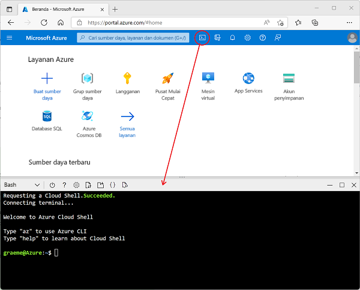

---
lab:
  title: Mempelajari Azure Stream Analytics
  module: Explore data analytics in Azure
---

## Mempelajari Azure Stream Analytics

Dalam latihan ini, Anda akan memprovisikan pekerjaan Azure Stream Analytics di langganan Azure Anda, dan menggunakannya untuk memproses aliran data real-time.

> <bpt id="p1">**</bpt>Note<ept id="p1">**</ept>: The exercise is part of a module on Microsoft Learn, and includes an option to use a <bpt id="p2">*</bpt>sandbox<ept id="p2">*</ept> Azure subscription. However, if you are completing this exercise as part of an instructor-led class, you should use the Azure subscription provided as part of the class instead of the sandbox.

Sebelum memulai latihan di Microsoft Learn, Anda harus menyiapkan lingkungan cloud shell untuk langganan Azure Anda.

1. Masuk ke langganan Azure Anda di [portal Azure](https://portal.azure.com) di `https://portal.azure.com`, menggunakan info masuk langganan Azure Anda.
2. Use the <bpt id="p1">**</bpt>[<ph id="ph1">\&gt;</ph>_]<ept id="p1">**</ept> button to the right of the search bar at the top of the page to create a new Cloud Shell in the Azure portal, selecting a <bpt id="p2">***</bpt>Bash<ept id="p2">***</ept> environment and creating storage if prompted. The cloud shell provides a command line interface in a pane at the bottom of the Azure portal, as shown here:

    

3. Note that you can resize the cloud shell by dragging the separator bar at the top of the pane, or by using the <bpt id="p1">**</bpt>&amp;#8212;<ept id="p1">**</ept>, <bpt id="p2">**</bpt>&amp;#9723;<ept id="p2">**</ept>, and <bpt id="p3">**</bpt>X<ept id="p3">**</ept> icons at the top right of the pane to minimize, maximize, and close the pane. For more information about using the Azure Cloud Shell, see the <bpt id="p1">[</bpt>Azure Cloud Shell documentation<ept id="p1">](https://docs.microsoft.com/azure/cloud-shell/overview)</ept>.

4. Sekarang Anda siap untuk menyelesaikan latihan di Microsoft Learn - gunakan saja cloud shell di portal Azure Anda, bukan yang (kosong) di modul Learn (yang disediakan untuk pelajar mandiri yang menggunakan langganan kotak pasir).

    Gunakan tautan di bawah ini untuk membuka latihan di Microsoft Learn.

    **[Buka Microsoft Learn](https://docs.microsoft.com/learn/modules/explore-fundamentals-stream-processing/5-exercise-stream-analytics#create-azure-resources)**

> **Pembelajaran lebih lanjut**: Jika Anda punya waktu nanti, Anda mempertimbangkan untuk kembali ke modul Microsoft Learn ini dan mencoba latihan lain yang ada di dalamnya, termasuk menjelajahi Spark Streaming dan Azure Synapse Data Explorer.
