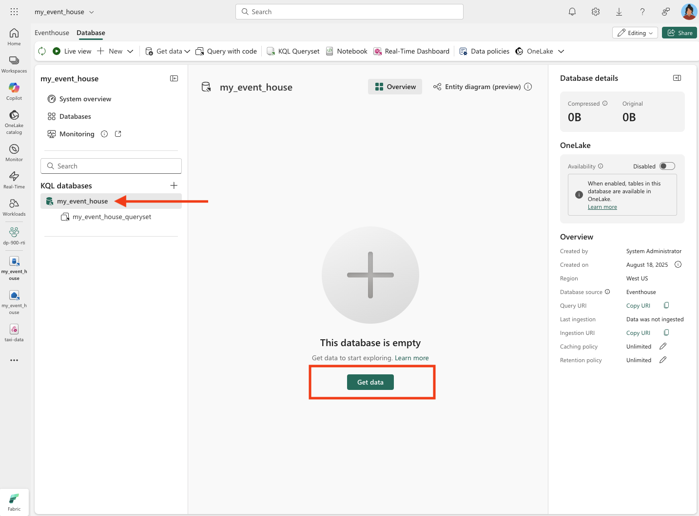

---
lab:
  title: Jelajahi analitik real-time di Microsoft Fabric
  module: Explore real-time analytics in Microsoft Fabric
---

# Jelajahi analitik real-time di Microsoft Fabric

Microsoft Fabric menyediakan Real-Time Intelligence, memungkinkan Anda membuat solusi analitik untuk aliran data real time. Dalam latihan ini, Anda akan menggunakan kemampuan Real-Time Intelligence di Microsoft Fabric untuk mencerna, menganalisis, dan memvisualisasikan aliran data real time dari perusahaan taksi.

Lab ini membutuhkan waktu sekitar **30** menit untuk menyelesaikannya.

> **Catatan**: Anda memerlukan [penyewa](https://learn.microsoft.com/fabric/get-started/fabric-trial) Microsoft Fabric untuk menyelesaikan latihan ini.

## Membuat ruang kerja

Sebelum bekerja dengan data di Fabric, Anda perlu membuat ruang kerja dengan kapasitas Fabric diaktifkan.

> _**Tips**: Ruang kerja adalah kontainer untuk semua yang Anda buat (eventstream, eventhouse, dasbor). Kapasitas fabric memungkinkan item ini berjalan._

1. Navigasi ke [beranda](https://app.fabric.microsoft.com/home?experience=fabric) Microsoft Fabric di `https://app.fabric.microsoft.com/home?experience=fabric` browser, dan masuk dengan kredensial Fabric Anda.

1. Pada bilah menu di sebelah kiri, pilih **Ruang Kerja** (ikon terlihat mirip dengan ).

1. Buat ruang kerja baru dengan nama pilihan Anda, pilih mode lisensi yang mencakup kapasitas Fabric (*Uji Coba*, *Premium*, atau *Fabric*).

    > _**Tips**: Menggunakan kapasitas yang mencakup Fabric memastikan ruang kerja memiliki mesin yang diperlukan untuk penyerapan dan analitik real time. Ruang kerja terpisah membuat sumber daya lab terisolasi dan mudah dibersihkan._

1. Saat ruang kerja baru Anda terbuka, ruang kerja harus kosong.

    

## Membuat eventstream

Sekarang Anda siap untuk menemukan dan menyerap data real-time dari sumber streaming. Untuk melakukan ini, Anda akan mulai di Fabric Real-Time Hub.

> _**Tips**: Hub Real Time mempusatkan sumber streaming dan memudahkan untuk menghubungkannya. Eventstream menjahit sumber ke tujuan dan dapat menambahkan transformasi di antaranya._

> **Tips**: Saat pertama kali Anda menggunakan Hub Real-Time, beberapa *tips memulai* mungkin ditampilkan. Anda dapat menutup ini.

1. Di bilah menu di sebelah kiri, pilih **hub Real-Time** .

    Hub real time menyediakan cara mudah untuk menemukan dan mengelola sumber data streaming.

    

1. Di hub real time, di bagian **Sambungkan ke** , pilih **Sumber data**.

1. **Temukan sumber data sampel taksi** kuning dan pilih **Sambungkan**. Kemudian di wizard Sambungkan **, beri nama sumber `taxi` dan edit nama eventstream default untuk mengubahnya menjadi `taxi-data`.** Aliran default yang terkait dengan data ini akan secara otomatis diberi nama *taxi-data-stream*:

    > _**Tips**: Sampel taksi Kuning adalah aliran publik yang aman—tidak diperlukan kredensial—dan konsisten untuk semua pelajar. Nama yang jelas memudahkan Anda menemukan sumber, eventstream, dan streaming nanti._

    

1. Pilih **Berikutnya** dan tunggu sumber dan eventstream dibuat, lalu pilih **Buka eventstream**. Eventstream akan menampilkan **sumber taksi** dan **aliran** data taksi di kanvas desain:

   

## Membuat eventhouse

Eventstream menyerap data taksi real-time, tetapi saat ini tidak melakukan apa pun dengannya. Mari kita buat eventhouse tempat kita dapat menyimpan data yang diambil dalam tabel.

> _**Tips**: Eventhouse memberi Anda penyimpanan tahan lama dan database KQL sehingga Anda dapat mempertahankan aliran dan mengkuerinya nanti—bahkan saat peristiwa baru tiba. KQL (Bahasa Kueri Kusto) adalah bahasa baca-saja, seperti SQL yang digunakan untuk menjelajahi, memfilter, dan menganalisis himpunan data besar dengan cepat_

1. Pada bilah menu di sebelah kiri, pilih **Buat**. Di halaman *Baru* , di bawah bagian *Inteligensi* Real-Time, pilih **Eventhouse**. Beri nama unik pilihan Anda.

    >**Catatan**: Jika **opsi Buat** tidak disematkan ke bar samping, Anda perlu memilih opsi elipsis (**...**) terlebih dahulu.

    

    Tutup tips atau perintah apa pun yang ditampilkan hingga Anda melihat eventhouse kosong baru Anda.

    

1. Di panel sebelah kiri, perhatikan bahwa eventhouse Anda berisi database KQL dengan nama yang sama dengan eventhouse. Anda dapat membuat tabel untuk data real time Anda dalam database ini, atau membuat database tambahan seperlunya.

1. Pilih database, dan perhatikan bahwa ada set* kueri terkait*. File ini berisi beberapa contoh kueri KQL yang bisa Anda gunakan untuk mulai mengkueri tabel dalam database Anda.

    > _**Tips**: Database KQL menyimpan tabel Anda. Set kueri adalah tempat yang berguna untuk menulis dan menjalankan kueri tanpa penyiapan tambahan._

    Namun, saat ini tidak ada tabel untuk dikueri. Mari kita atasi masalah tersebut dengan mendapatkan data dari eventstream ke dalam tabel baru.

1. Di halaman utama database KQL Anda, pilih **Dapatkan data**.

    

1. Untuk sumber data, pilih **Eventstream Eventstream**** > ** Yang Ada.

1. Di panel **Pilih atau buat tabel** tujuan, buat tabel baru bernama `taxi`. Kemudian di panel **Konfigurasikan sumber** data, pilih ruang kerja Anda dan **eventstream data** taksi dan beri nama koneksi `taxi-table`.

   

1. Gunakan tombol **Berikutnya** untuk menyelesaikan langkah-langkah untuk memeriksa data lalu **menyelesaikan** konfigurasi. Kemudian tutup jendela konfigurasi untuk melihat eventhouse Anda dengan tabel taksi.

   

    Koneksi antara aliran dan tabel telah dibuat. Mari kita verifikasi bahwa dalam eventstream.

1. Di bilah menu di sebelah kiri, pilih **hub Real-Time** lalu lihat **halaman Aliran** data saya. **Di menu ...** untuk **aliran aliran** taksi-data, pilih **Buka eventstream**.

    Eventstream sekarang menampilkan tujuan untuk aliran:

   

    > _**Tips**: Pilih tujuan pada kanvas desain, dan jika tidak ada pratinjau data yang ditampilkan di bawahnya, pilih **Refresh**._

    > _**Tips**: Memverifikasi di eventstream mengonfirmasi bahwa peristiwa mengalir ke tujuan. Pratinjau dapat di-cache — refresh menarik sampel terbaru._

    Dalam latihan ini, Anda telah membuat eventstream yang sangat sederhana yang menangkap data real-time dan memuatnya ke dalam tabel. Dalam solusi nyata, Anda biasanya akan menambahkan transformasi untuk mengagregasi data melalui jendela temporal (misalnya, untuk menangkap harga rata-rata setiap saham selama periode lima menit).

    Sekarang mari kita jelajahi bagaimana Anda bisa mengkueri dan menganalisis data yang diambil.

## Mengkueri data yang diambil

Eventstream menangkap data tarif taksi real time dan memuatnya ke dalam tabel di database KQL Anda. Anda bisa mengkueri tabel ini untuk melihat data yang diambil.

> _**Tips**: KQL dirancang untuk eksplorasi cepat data bertanda waktu dan volume tinggi. Kueri memungkinkan Anda memvalidasi penyerapan dan segera memulai analisis._

1. Di bilah menu di sebelah kiri, pilih database eventhouse Anda.

1. Pilih set *kueri* untuk database Anda.

1. Di panel kueri, ubah contoh kueri pertama seperti yang diperlihatkan di sini:

    ```kql
    taxi
    | take 100
    ```

    > _**Tips**: `take 100` adalah pemeriksaan kesehatan cepat—konfirmasikan baris tiba dan periksa sampel kecil tanpa memindai semuanya._

1. Pilih kode kueri dan jalankan untuk melihat 100 baris data dari tabel.

    

1. Tinjau hasilnya, lalu ubah kueri untuk memperlihatkan jumlah pengambilan taksi untuk setiap jam:

    ```kql
    taxi
    | summarize PickupCount = count() by bin(todatetime(tpep_pickup_datetime), 1h)
    ```

1. Sorot kueri yang dimodifikasi dan jalankan untuk melihat hasilnya.

    > _**Tips**: `bin(..., 1h)` mengelompokkan peristiwa ke dalam wadah per jam, sehingga mudah untuk melihat tren dari waktu ke waktu._

1. Tunggu beberapa detik dan jalankan lagi, mencatat bahwa jumlah pengambilan berubah saat data baru ditambahkan ke tabel dari aliran real-time.

    > _**Tips**: Aliran terus menambahkan data, sehingga hasil berubah dari waktu ke waktu. Menjalankan kembali menunjukkan bagaimana agregasi diperbarui saat peristiwa baru tiba._

## Membersihkan sumber daya

Dalam latihan ini, Anda telah membuat eventhouse, menyerap data real time menggunakan eventstream, mengkueri data yang diserap dalam tabel database KQL, membuat dasbor real time untuk memvisualisasikan data real time, dan mengonfigurasi pemberitahuan menggunakan Activator.

Jika Anda telah selesai menjelajahi Real-Time Intelligence di Fabric, Anda dapat menghapus ruang kerja yang Anda buat untuk latihan ini.

> _**Tips**: Menghapus ruang kerja menghapus semua item yang dibuat di lab dan membantu mencegah biaya yang sedang berlangsung._

1. Di bilah di sebelah kiri, pilih ikon untuk ruang kerja Anda.

1. Di toolbar, pilih **Pengaturan** ruang kerja.

1. Di bagian **Umum** , pilih **Hapus ruang** kerja ini.
