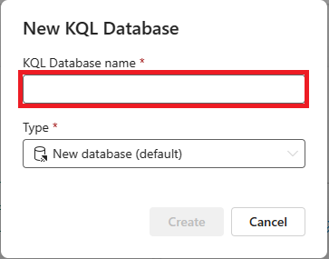

---
lab:
  title: Jelajahi analitik real-time di Microsoft Fabric
  module: Explore fundamentals of large-scale data analytics
---

# Jelajahi analitik real-time di Microsoft Fabric

Dalam latihan ini Anda akan menjelajahi analitik real-time di Microsoft Fabric.

Membutuhkan waktu sekitar **25** menit untuk menyelesaikan lab ini.

> **Catatan**: Anda memerlukan lisensi Microsoft Fabric untuk menyelesaikan latihan ini. Lihat [Mulai menggunakan Fabric](https://learn.microsoft.com/fabric/get-started/fabric-trial) untuk detail cara mengaktifkan lisensi uji coba Fabric gratis. Anda akan memerlukan akun *sekolah*atau *kerja* Microsoft untuk melakukan ini. Jika Anda tidak memilikinya, Anda bisa [mendaftar untuk uji coba Microsoft Office 365 E3 atau yang lebih tinggi](https://www.microsoft.com/microsoft-365/business/compare-more-office-365-for-business-plans).

## Membuat ruang kerja

Sebelum mengerjakan data di Fabric, buat ruang kerja dengan uji coba Fabric diaktifkan.

1. Masuk ke [Microsoft Fabric](https://app.fabric.microsoft.com) di `https://app.fabric.microsoft.com`.
2. Pada bilah menu di sebelah kiri, pilih **Ruang Kerja** (ikon terlihat mirip dengan ).
3. Buat ruang kerja baru dengan nama pilihan Anda, pilih mode lisensi di bagian **Tingkat Lanjut** yang mencakup kapasitas Fabric (*Uji Coba*, *Premium*, atau *Fabric*).
4. Saat ruang kerja baru Anda terbuka, ruang kerja harus kosong.

    

## Membuat data base KQL

Sekarang karena Anda memiliki ruang kerja, Anda dapat membuat database KQL untuk menyimpan data real-time.

1. Di kiri bawah portal, beralihlah ke pengalaman **Analitik Real Time**.

    

    Beranda analitik real time mencakup petak-petak untuk membuat aset yang umum digunakan untuk analisis data real time

2. Di beranda analitik real time, buat **Database KQL ** baru dengan nama pilihan Anda.

    

   Anda akan melihat layar dasbor lalu memilih tombol KQL Database di bagian atas.

    

    Setelah dipilih, Anda akan diberi ***kotak dialog Database*** KQL Baru tempat Anda akan memberi nama KQL Database Anda.

    

   - beri nama database, dalam skenario ini, yaitu: `my_kql_db`
   - klik, ***Buat***
  
    Setelah satu menit atau lebih, database KQL baru akan dibuat:

    Saat ini, tidak ada tabel dalam database.

## Membuat eventstream

Eventstreams menyediakan cara yang dapat diskalakan dan fleksibel untuk menyerap data real time dari sumber streaming.

1. Di bilah menu di sebelah kiri, pilih halaman **Beranda** untuk pengalaman analitik real time.
1. Pada halaman Beranda, pilih petak-petak untuk membuat **Eventstream** baru dengan nama pilihan Anda.

    Setelah beberapa saat, perancang visual untuk eventstream Anda ditampilkan.

    

    Kanvas perancang visual menunjukkan sumber yang terhubung ke eventstream Anda, yang pada gilirannya terhubung ke tujuan.

1. Pada kanvas perancang, di daftar **Sumber baru** untuk sumber Anda, pilih **Sampel data**. Kemudian di panel **Data sampel** , tentukan nama **taksi** dan pilih data sampel **Taksi Kuning** (yang mewakili data yang dikumpulkan dari perjalanan taksi). Kemudian pilih **Tambahkan**.
1. Di bawah kanvas perancang, pilih tab **Pratinjau data** untuk melakukan pratinjau data yang dialirkan dari sumber:

    

1. Pada kanvas perancang, di daftar **Tujuan baru**untuk tujuan Anda, pilih **database KQL**. Kemudian di panel **database KQL**, tentukan nama tujuan **taxi-data** dan pilih ruang kerja Anda dan database KQL. Lalu pilih **Buat dan konfigurasikan**.
1. Di wizard ** Serap data**, pada halaman **Tujuan**, pilih **Tabel barul** dan masukkan nama tabel **taxi-data**. Lalu pilih **Berikutnya: Sumber Daya**.
1. Pada halaman **Sumber** , tinjau nama koneksi data default, lalu pilih **Berikutnya: Skema**.
1. Pada halaman **Skema** , ubah **Format data**dari TXT ke **JSON**, dan lihat pratinjau untuk memverifikasi bahwa format ini menghasilkan beberapa kolom data. Pilih **Berikutnya: Ringkasan**.
1. Pada halaman **Ringkasan** , tunggu hingga penyerapan berkelanjutan dibuat, lalu pilih **Tutup**.
1. Verifikasi bahwa eventstream Anda yang telah selesai terlihat seperti ini:

    

## Melakukan kueri data real time dalam database KQL

Eventstream Anda terus mengisi tabel di database KQL Anda, memungkinkan Anda untuk melakukan kueri data real-time.

1. Di hub menu di sebelah kiri, pilih database KQL Anda (atau pilih ruang kerja Anda dan temukan database KQL Anda di sana).
1. Di menu **...** untuk tabel **data taksi** (yang telah dibuat oleh eventstream Anda), pilih **Tabel kueri > Rekaman yang diserap dalam 24 jam** terakhir.

    

1. Tampilkan hasil kueri, yang seharusnya menjadi kueri KQL seperti ini:

    ```kql
    ['taxi-data']
    | where ingestion_time() between (now(-1d) .. now())
    ```

    Hasilnya menunjukkan semua catatan taksi yang diserap dari sumber streaming dalam 24 jam terakhir.

1. Ganti semua kode kueri KQL di bagian atas editor kueri dengan kode berikut:

    ```kql
    // This query returns the number of taxi pickups per hour
    ['taxi-data']
    | summarize PickupCount = count() by bin(todatetime(tpep_pickup_datetime), 1h)
    ```

1. Gunakan tombol **▷ Jalankan** untuk menjalankan kueri dan meninjau hasilnya, yang menunjukkan jumlah penjemputan taksi untuk setiap jam.

## Membersihkan sumber daya

Jika Anda telah selesai menjelajahi analitik real-time di Microsoft Fabric, Anda dapat menghapus ruang kerja yang Anda buat untuk latihan ini.

1. Di bilah di sebelah kiri, pilih ikon untuk ruang kerja Anda untuk melihat semua item yang ada di dalamnya.
2. Di menu **...** pada toolbar, pilih **Pengaturan ruang kerja**.
3. Di bagian **Lainnya** , pilih **Hapus ruang kerja ini**.
