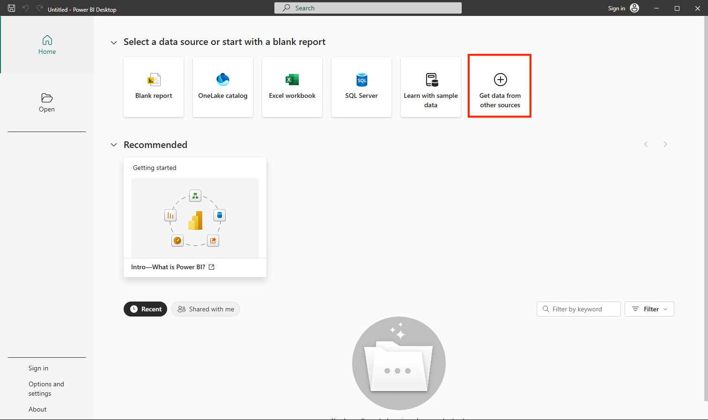
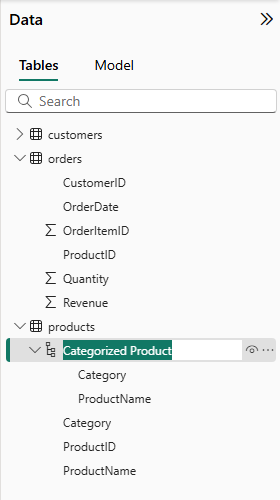

---
lab:
  title: Menjelajahi dasar-dasar visualisasi data dengan Power BI
  module: Explore fundamentals of data visualization
---

# <a name="explore-fundamentals-of-data-visualization-with-power-bi"></a>Menjelajahi dasar-dasar visualisasi data dengan Power BI

Dalam latihan ini Anda akan menggunakan Microsoft Power BI Desktop untuk membuat model data dan laporan yang berisi visualisasi data interaktif.

Membutuhkan waktu sekitar **20** menit untuk menyelesaikan lab ini.

## <a name="before-you-start"></a>Sebelum Anda memulai

Anda memerlukan [langganan Azure](https://azure.microsoft.com/free) dengan akses tingkat administratif.

### <a name="install-power-bi-desktop"></a>Menginstal Power BI Desktop

Jika Microsoft Power BI Desktop belum terinstal di komputer Windows, Anda dapat mengunduh dan menginstalnya secara gratis.

1. Unduh penginstal Power BI Desktop dari [https://aka.ms/power-bi-desktop](https://aka.ms/power-bi-desktop?azure-portal=true).
1. Ketika file telah diunduh, buka, dan gunakan wizard penyiapan untuk menginstal Power BI Desktop di komputer Anda. Penginstalan ini mungkin membutuhkan waktu beberapa menit.

## <a name="import-data"></a>Impor data

1. Buka Power BI Desktop. Antarmuka aplikasi akan terlihat seperti ini:

    

    Sekarang Anda siap mengimpor data untuk laporan Anda.

1. Pada layar selamat datang Power BI Desktop, pilih **Dapatkan data**, lalu dalam daftar sumber data, pilih **Web** lalu pilih **Hubungkan**.

    

1. Di kotak dialog **Dari web**, masukkan URL berikut, lalu pilih **OK**:

    ```
    https://github.com/MicrosoftLearning/DP-900T00A-Azure-Data-Fundamentals/raw/master/power-bi/customers.csv
    ```

1. Di dialog konten Access Web, pilih **Hubungkan**.

1. Verifikasi bahwa URL membuka himpunan data yang berisi data pelanggan, seperti yang ditunjukkan di bawah ini. Kemudian pilih **Muat** untuk memuat data ke dalam model data untuk laporan Anda.

    

1. Di jendela utama Power BI Desktop, di menu Data, pilih **Dapatkan data**, lalu pilih **Web**:

    

1. Di kotak dialog **Dari web**, masukkan URL berikut, lalu pilih **OK**:

    ```
    https://github.com/MicrosoftLearning/DP-900T00A-Azure-Data-Fundamentals/raw/master/power-bi/products.csv
    ```

1. Di dialog, pilih **Muat** untuk memuat data produk dalam file ini ke dalam model data.

1. Ulangi tiga langkah sebelumnya untuk mengimpor himpunan data ketiga yang berisi data pesanan dari URL berikut:

    ```
    https://github.com/MicrosoftLearning/DP-900T00A-Azure-Data-Fundamentals/raw/master/power-bi/orders.csv
    ```

## <a name="explore-a-data-model"></a>Menjelajahi model data

Tiga tabel data yang telah Anda impor telah dimuat ke dalam model data, yang sekarang akan Anda jelajahi dan perbaiki.

1. Di Power BI Desktop, di tepi kiri, pilih tab **Model**, lalu susun tabel dalam model sehingga Anda dapat melihat tabel tersebut. Anda dapat menyembunyikan panel di sisi kanan menggunakan ikon **>>** :

    

1. Di tabel **pesanan**, pilih bidang **Pendapatan**, lalu di panel **Properti**, atur properti **Format** ke **Mata Uang**:

    

    Langkah ini dapat memastikan bahwa nilai pendapatan ditampilkan sebagai mata uang dalam visualisasi laporan.

1. Di tabel produk, klik kanan bidang **Kategori** (atau buka menu **&vellip;** ) dan pilih **Buat hierarki**. Langkah ini membuat hierarki bernama **Hierarki Kategori**. Anda mungkin perlu memperluas atau menggulir di tabel **produk** untuk melihat ini - Anda juga dapat melihatnya di panel **Bidang**:

    

1. Di tabel produk, klik kanan bidang **ProductName** (atau buka menu **&vellip;** ) dan pilih **Tambahkan ke hierarki** > **Hierarki Kategori**. Tindakan ini menambahkan bidang **ProductName** ke hierarki yang Anda buat sebelumnya.
1. Di panel **Bidang**, klik kanan **Hierarki Kategori** (atau buka menu **...**) dan pilih **Ganti Nama**. Kemudian ganti nama hierarki menjadi **Produk yang Dikategorikan**.

    

1. Di tepi kiri, pilih tab **Data**, lalu di panel **Bidang**, pilih tabel **pelanggan**.
1. Pilih header kolom **Kota**, lalu atur properti **Kategori Data** ke **Kota**:

    

    Langkah ini dapat memastikan bahwa nilai dalam kolom ini diinterpretasikan sebagai nama kota, yang berguna jika Anda ingin menyertakan visualisasi peta.

## <a name="create-a-report"></a>Membuat laporan

Sekarang Anda hampir siap untuk membuat laporan. Pertama, Anda perlu memeriksa beberapa pengaturan untuk memastikan semua visualisasi diaktifkan.

1. Pada menu **File**, pilih **Opsi dan Pengaturan**. Kemudian pilih **Opsi**, dan di bagian **Keamanan**, pastikan **Gunakan visual Peta dan Peta yang Diisi** aktif dan pilih **OK**.

    

    Pengaturan ini memastikan bahwa Anda dapat menyertakan visualisasi peta dalam laporan.

1. Di tepi kiri, pilih tab **Laporan** dan lihat antarmuka desain laporan.

    

1. Di pita, di atas permukaan desain laporan, pilih **Kotak Teks** dan tambahkan kotak teks yang berisi teks **Laporan Penjualan** ke laporan. Format teks menjadi tebal dengan ukuran font 32.

    

1. Pilih area kosong pada laporan untuk membatalkan pilihan kotak teks. Kemudian di panel **Bidang**, luaskan **Produk** dan pilih bidang **Produk yang Dikategorikan**. Langkah ini menambahkan tabel ke laporan.

    

1. Dengan tabel masih dipilih, di panel **Bidang**, luaskan **Pesanan** dan pilih **Pendapatan**. Kolom Pendapatan ditambahkan ke dalam tabel. Anda mungkin perlu memperluas ukuran tabel untuk melihat kolom Pendapatan.

    Pendapatan diformat sebagai mata uang, seperti yang Anda tentukan dalam model. Namun, Anda tidak menentukan jumlah tempat desimal, jadi nilainya menyertakan jumlah pecahan. Anda dapat kembali ke tab **Model** atau **Data** dan mengubah nilai desimalnya jika perlu, meskipun tidak ada masalah dengan visualisasi yang akan dibuat.

    

1. Dengan tabel masih dipilih, di panel **Visualisasi**, pilih visualisasi **Bagan kolom bertumpuk**. Tabel diubah menjadi bagan kolom yang menunjukkan pendapatan menurut kategori.

    

1. Di bagan kolom yang dipilih, pilih ikon **&#8595;** untuk mengaktifkan penelusuran mendetail. Kemudian pada bagan, pilih kolom kedua (*Sepeda Jalan*) untuk menelusuri dan melihat pendapatan masing-masing produk dalam kategori ini. Kemampuan ini dapat digunakan karena Anda mendefinisikan hierarki kategori dan produk.

    

1. Gunakan ikon **&#x2191;** untuk menelusuri cadangan pada tingkat kategori. Kemudian pilih ikon **(** &#8595; **)** untuk menonaktifkan fitur penelusuran mendetail.
1. Pilih area kosong pada laporan, lalu di panel **Bidang**, pilih bidang **Kuantitas** di tabel **pesanan** dan **Kategori** bidang dalam tabel **produk**. Langkah ini menghasilkan bagan kolom lain yang menunjukkan kuantitas penjualan berdasarkan kategori produk.
1. Dengan bagan kolom baru yang dipilih, di panel **Visualisasi**, pilih **Bagan pai** lalu ubah ukuran bagan dan posisikan di sebelah bagan kolom pendapatan berdasarkan kategori.

    

1. Pilih area kosong laporan, lalu di panel **Bidang**, pilih bidang **Kota** di tabel **pelanggan**, lalu pilih **Pendapatan** di tabel **pesanan**. Diagram lingkaran ini menghasilkan peta yang menunjukkan pendapatan penjualan berdasarkan kota. Atur ulang dan ubah ukuran visualisasi sesuai kebutuhan:

    

1. Di peta, perhatikan bahwa Anda dapat menyeret, mengklik dua kali, menggunakan roda mouse, atau mencubit dan menyeret pada layar sentuh untuk berinteraksi. Kemudian pilih kota tertentu, dan perhatikan bahwa visualisasi lain dalam laporan dimodifikasi untuk menyorot data kota yang dipilih.

    

1. Pada menu **File**, pilih **Simpan**. Kemudian simpan file dengan nama file .pbix yang sesuai. Anda dapat membuka file dan menjelajahi pemodelan dan visualisasi data lebih lanjut saat Anda luang.

Jika Anda memiliki langganan [layanan Power BI](https://www.powerbi.com/?azure-portal=true), Anda dapat masuk ke akun dan menerbitkan laporan ke ruang kerja Power BI. 
